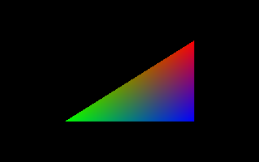

<table cellspacing="0" cellpadding="0"><tbody>
<tr valign="top"><td width="60%" colspan="2">

# Volcano Sample 1: GLFW Application

This sample uses [Volcano](https://github.com/ndsol/volcano) to draw a triangle
on the screen. Like most "first triangle" tutorials, this walks through setting
up a project, shaders, and a main loop.

</td></tr><tr valign="top"><td width="60%">

[View source code](./)

1. [Goals](#goals)
1. [Create a new project](#create-a-new-project)
   1. [Add an executable() to BUILD.gn](#add-an-executable-to-buildgn)
   1. [Create the C++ Source file](#create-the-c-source-file)
   1. [Add the GLFW library](#add-the-glfw-library)
   1. [What is `language::Instance`?](#what-is-languageinstance)
1. [Create Shaders](#create-shaders)
   1. [Compiling Vulkan Shaders](#compiling-vulkan-shaders)
   1. [Loading Compiled Shaders in Volcano](#loading-compiled-shaders-in-volcano)
1. [Presenting an Image to the Screen](#presenting-an-image-to-the-screen)
   1. [Use VK_KHR_swapchain to Display Images](#use-vk_khr_swapchain-to-display-images)
   1. [Putting It All Together](#putting-it-all-together)
   1. [Drawing Commands go in Command Buffers](#drawing-commands-go-in-command-buffers)
1. [BaseApplication](#baseapplication)
1. [Android](#android)
1. [The End](#the-end)

</td><td width="40%">



[The top level README](https://github.com/ndsol/VolcanoSamples/) shows how to
build this sample.

Run this sample by typing:<br/>`out/Debug/01glfw`

Enable Vulkan Validation layers by typing:<br/>
`VK_INSTANCE_LAYERS=\`<br/>
`VK_LAYER_LUNARG_standard_validation \`<br/>
`out/Debug/01glfw`</td></tr>
</tbody></table>

## Goals

Each sample has a few goals that build on previous concepts. This sample should
teach you the following:

1. How to set up your environment and make a new app that uses Volcano.

2. Where the pieces plug in (shaders, main loop, draw commands).

3. Which Vulkan types you'll need to keep track of.

<details>
<summary><b>Q:</b> How do I get started learning Vulkan? [Click to expand]
</summary>

**Answer:** These pages from https://vulkan-tutorial.com are necessary
background:

1. [Overview](https://vulkan-tutorial.com/Overview)
1. [Drawing a triangle](https://vulkan-tutorial.com/Drawing_a_triangle)
1. [Creating an instance](https://vulkan-tutorial.com/Drawing_a_triangle/Setup/Instance)
1. [Validation layers](https://vulkan-tutorial.com/Drawing_a_triangle/Setup/Validation_layers)
1. [Physical devices and queue families](https://vulkan-tutorial.com/Drawing_a_triangle/Setup/Physical_devices_and_queue_families)
1. [Logical devices and queues](https://vulkan-tutorial.com/Drawing_a_triangle/Setup/Logical_device_and_queues)
1. [Graphics pipeline basics](https://vulkan-tutorial.com/Drawing_a_triangle/Graphics_pipeline_basics)
1. [Shader modules](https://vulkan-tutorial.com/Drawing_a_triangle/Graphics_pipeline_basics/Shader_modules)
1. [Fixed functions](https://vulkan-tutorial.com/Drawing_a_triangle/Graphics_pipeline_basics/Fixed_functions)

Yes, please read all of those links! Give yourself about 4 hours for this
reading. You don't have to build or run the code, but it doesn't hurt!

You should also bookmark
[the Vulkan Spec](https://www.khronos.org/registry/vulkan/specs/1.1-extensions/html/)
itself. It is surprisingly readable and is the **official** answer on any
Vulkan question.

These samples dive into Vulkan fast! It does not make sense to duplicate
https://vulkan-tutorial.com here.

*Strategy Tip:* Note down any questions you have while studying
https://vulkan-tutorial.com, then see if this sample (Sample 1) answers any of
them.

--------

</details><details>
<summary><b>Q:</b> I am getting a GLFW error. How do I learn GLFW?
[Click to expand]</summary>

**Answer:** Good [GLFW](http://www.glfw.org/)-related help is available on the
normal question-and-answer sites like stackoverflow.com, quora.com, etc.

--------

</details>

## Create a new project

Sample 1 is a completed, simple project. We will start a new project and
gradually build up to a full sample. This will recreate Sample 1 to show how
it's done.

Before you do anything else run `./build.cmd` in the VolcanoSamples directory.
(On Windows, replace all forward slashes such as `./build.cmd` with a
backslash: `.\build.cmd`.)

You will need to install the following, or build.cmd will complain:
* **Python  3.**
* **A compiler.** The free version of Visual Studio works.
  (Be sure to get [Visual C++](visual-studio-cli.png).) For Mac OS,
  install the compiler by typing `xcode-select --install`. For linux,
  build.cmd itself will tell you the commands to install the compiler.

build.cmd automatically downloads the rest: the Vulkan SDK, GLFW,
SPIRV-Cross, SPIRV-Tools, etc.

**Important:** The build.cmd script will complain and give you instructions if
you should install additional software. Please do it now!

After the build has finished, try out Sample 1 by typing:<br/>
`out/Debug/01glfw`

(On Windows: `out\Debug\01glfw.exe`)

If you choose to update your PATH variable, you can avoid typing
`vendor/subgn/ninja -C out/Debug`.

On macOS or linux type: `export PATH=$PATH:$PWD/vendor/subgn`

On windows type: `set PATH=%PATH%;%CD%\vendor\subgn`

Now you should be able to just run ninja:

```
$ ninja -C out/Debug
ninja: Entering directory `out/Debug'
ninja: no work to do.
```

If you can run the `01glfw` sample, then the build system is working. You
can now create a new executable.

### Add an executable() to BUILD.gn


Once build.cmd has run, you can create a new project.
[Volcano](https://github.com/ndsol/volcano) uses the
[chromium GN build system](https://chromium.googlesources.com/chromium/src/tools/gn/).
You should be aware of other build systems as well!

* [CMake.org](https://cmake.org)
* [MSBuild](https://docs.microsoft.com/en-us/visualstudio/msbuild/msbuild)
* [GNU Make](https://www.gnu.org/software/make/)

Volcano uses
[the GN build system](https://github.com/ndsol/subgn/blob/master/tools/gn/docs/reference.md)
to keep things simple. The build.cmd script runs `gn` to create the
`out/Debug` directory.

(This allows you to have other configs like an `out/Release` directory later.)

After `out/Debug` has `build.ninja` written to it, you just type
`ninja -C out/Debug` to rebuild the project. Ninja will re-run `gn` if the
BUILD.gn file has changed.

Let's test that in practice. Go to the VolcanoSamples top-level dir
(not the 01glfw dir) and edit [BUILD.gn](../BUILD.gn) there. Add a few lines
at the top, starting with `executable("triangle")`:

```
# Copyright (c) 2017-2018 the Volcano Authors. Licensed under GPLv3.
import("//src/gn/vendor/glslangValidator.gni")

# Add an executable() here:
executable("triangle") {
  sources = [ "triangle.cpp" ]
}

# If these samples build ok, then assume all samples will build ok.
group("build_first") {
...
```

That's it. You've created a new project. Since it is not the default build
target, you have to tell ninja if you want to build it. Try building it
by typing:

`ninja -C out/Debug triangle`

Of course, it complains:

```
ninja: Entering directory `out/Debug'
ninja: error: '../../triangle.cpp', needed by 'obj/triangle/triangle.o', missing and no known rule to make it
```

### Create the C++ Source file

Create a new file, `triangle.cpp` and put this in it:

```C++
#include <stdio.h>

int crossPlatformMain() {
  printf("Hello world.\n");
  return 0;
}

#ifdef _WIN32
int APIENTRY WinMain(HINSTANCE, HINSTANCE, LPSTR, int) {
  return crossPlatformMain();
}
#elif defined(__ANDROID__)
extern "C" void android_main(android_app* app) {
  (void)crossPlatformMain();
}
#else
int main() {
  return crossPlatformMain();
}
#endif
```

If this seems boring: it really, really is. But the cross platform startup code
is there because Volcano is designed to put you completely in control of what
executes during startup. While keeping the boring stuff as short as possible,
this does not hide it completely. If you ever need to change it, it's there.

You can run your program now!

```
ninja -C out/Debug triangle
out/Debug/triangle
```

### Add the GLFW library

Now is a good time to link to [GLFW](http://www.glfw.org/) and Volcano. Expand
the `executable("triangle")` section in BUILD.gn to look like this:

```
executable("triangle") {
  sources = [ "triangle.cpp" ]
  deps = [
    "//src/gn/vendor/glfw",
    "//vendor/volcano",
  ]
}
```

#### Quick explanation:

`deps` tells gn and ninja to find and read another BUILD.gn file.

If you add a colon and a target, it will refer to something other than
the default target. The
[GN reference](https://github.com/ndsol/subgn/blob/master/tools/gn/docs/reference.md)
explains BUILD.gn files more fully.

Now expand triangle.cpp. Remove `#include <stdio.h>` and change
`crossPlatformMain()` so the file looks like this:

```C++
#define GLFW_INCLUDE_VULKAN
#include <GLFW/glfw3.h>

#ifdef _WIN32
#define GLFW_EXPOSE_NATIVE_WIN32
#include <GLFW/glfw3native.h>
#endif /* _WIN32 */

#include <src/language/language.h>

static void handleGlfwErrors(int error, const char* description) {
  printf("glfw error %d: %s\n", error, description);
}

// Wrap the function glfwCreateWindowSurface for Instance::ctorError():
static VkResult handleCreateSurface(language::Instance& inst, void* window)
{
  return glfwCreateWindowSurface(inst.vk, (GLFWwindow*) window, nullptr,
                                 &inst.surface);
}

const int WIDTH = 800, HEIGHT = 600;
int run(GLFWwindow* window) {
  language::Instance inst;

  unsigned int eCount = 0;
  const char** e = glfwGetRequiredInstanceExtensions(&eCount);
  inst.requiredExtensions.insert(inst.requiredExtensions.end(), e, &e[eCount]);

  if (inst.ctorError(handleCreateSurface, window)) {
    printf("inst.ctorError failed\n");
    return 1;
  }

  if (!inst.devs.size()) {
    printf("No vulkan devices found (or driver missing?)\n");
    return 1;
  }

  if (inst.open({WIDTH, HEIGHT})) {
    printf("inst.open failed\n");
    return 1;
  }

  while(!glfwWindowShouldClose(window)) {
    glfwPollEvents();  // This is the main loop.
  }
  return 0;
}

static int crossPlatformMain(int argc, char** argv) {
  (void)argc;  // Not used. Silence compiler warning.
  (void)argv;  // Not used. Silence compiler warning.
  glfwSetErrorCallback(handleGlfwErrors);
  glfwInit();

  glfwWindowHint(GLFW_CLIENT_API, GLFW_NO_API);

  GLFWwindow* window = glfwCreateWindow(
      WIDTH, HEIGHT, "My Title", nullptr /*monitor for fullscreen*/,
      nullptr /*context object sharing*/);
  if (!window) {
    printf("glfwCreateWindow failed\n");
    return 1;
  }

  int r = run(window);
  glfwDestroyWindow(window);
  glfwTerminate();
  return r;
}

#ifdef _WIN32
int APIENTRY WinMain(HINSTANCE, HINSTANCE, LPSTR, int) {
  return crossPlatformMain(__argc, __argv);
}
#elif defined(__ANDROID__)
extern "C" void android_main(android_app* app) {
  glfwAndroidMain(app, crossPlatformMain);
}
#else
int main(int argc, char** argv) {
  return crossPlatformMain(argc, argv);
}
#endif
```

This is how to init GLFW for Vulkan. The first Volcano code is in `run()`
and creates a `language::Instance inst`.

Run this with:

```
ninja -C out/Debug triangle
out/Debug/triangle
```

It will just display an empty window.

### What is `language::Instance`?

Volcano's
[`language::Instance`](https://github.com/ndsol/volcano/blob/master/src/language/language.h#L570)
does what the
[VkInstance](https://www.khronos.org/registry/vulkan/specs/1.1-extensions/man/html/VkInstance.html)
object in Vulkan does.

* `Instance` finds and loads any required instance extensions. In this sample
  you get that from GLFW. To keep things simple, just put GLFW's list of
  extensions in `Instance::requiredExtensions`. Later this is where you could
  request custom instance extensions if you want. But there are also device
  extensions - be aware of the difference!

* `Instance` loads any needed layers. It loads the validation layers if the
  `VK_INSTANCE_LAYERS` environment variable is set.

* `Instance` gets all physical devices. After `Instance::ctorError()` returns,
  your app can inspect the `Instance::devs` vector. The `devs` vector later
  has logical `Device` objects, but right now none of them are opened yet.
  At this stage, stick to the `dev.phys` member to look at the physical device.
  For example:

  ```C++
  if (inst.ctorError(...)) { ... handle error ... }
  for (auto& dev : inst.devs) {
    // inspect dev.phys here
  }
  if (inst.open(...)) {
  ```

  If there are multiple GPUs, the app can:
  1. Decide on one GPU by some sort of ranking of GPUs.
  2. Or enable `VK_KHR_device_group_creation` to access SLI or CrossFire.
  3. Or just use the default. Volcano will choose the GPU attached to the
     primary display.

* When the app calls `Instace::open`, the GPU or GPUs are "opened."
  The logical device is then available as `Instance::devs.at(0)`. A
  logical device can include multiple GPUs using
  `VK_KHR_device_group_creation`.

In triangle.cpp this is very simple:
```C++
  language::Instance inst;
  if (inst.ctorError(glfwExts, glfwExtCount, handleCreateSurface, window)) {
    return 1;
  }

  if (inst.open({WIDTH, HEIGHT})) {
    return 1;
  }
```

The underlying `VkInstance` object is accessible as `Instance::vk`.

## Create Shaders

A Vulkan app must always have a vertex and fragment shader.
[Sample 5](../05indexbuffer/README.md) explains pipeline stages and how the GPU
uses shaders. For now, we just need a very simple shader.

Create a new file `triangle.vert` and copy and paste the contents of
[01glfw.vert](01glfw.vert) into it.

Also create a file `triangle.frag` and copy the contents of
[01glfw.frag](01glfw.frag) into it.

### Compiling Vulkan Shaders

Edit `BUILD.gn` again and add a new section "triangle_shaders" above "triangle"
and use a `deps` entry to make "triangle" depend on "triangle_shaders":

```
glslangVulkanToHeader("triangle_shaders") {
  sources = [
    "triangle.vert",  # compile to bytecode available at "triangle.vert.h"
    "triangle.frag",  # compile to bytecode available at "triangle.frag.h"
  ]
}

executable("triangle") {
  sources = [ "triangle.cpp" ]
  deps = [
    ":triangle_shaders",  # Tells the compiler where to find triangle.vert.h
    "//src/gn/vendor/glfw",
    "//vendor/volcano:science",
  ]
}
```

Build the app again with `ninja -C out/Debug triangle`.

You can now see the new files containing the shader bytecode:

* out/Debug/gen/triangle.frag.h
* out/Debug/gen/triangle.vert.h

<details>
<summary><b>Q:</b> How are <code>triangle.frag.h</code> and
<code>triange.vert.h</code> generated? [Click to expand]
</summary>

**Answer:** Each header file contains just one variable. That variable is
generated with the SPIR-V bytecode from the shader source by a program called
`glslangValidator`.

The variable is an array of `uint32_t`. The variable name comes from the shader
source file name, with a Volcano-specific
[python](https://github.com/ndsol/volcano/blob/master/src/gn/vendor/glslangValidator.py#L55)
function to replace characters with `_` that would otherwise be invalid for a
C++ identifier.

The variable is prefixed with `spv_`. All put together, the variable name spit
out looks like this:

* For `triangle.vert`, the variable is `spv_triangle_vert`.
* For `triangle.frag`, the variable is `spv_triangle_frag`.
* For `01glfw.vert`, the variable is `spv_01glfw_vert`.
* For `01glfw.frag`, the variable is `spv_01glfw_frag`.

</details>

### Loading Compiled Shaders in Volcano

Vulkan Shaders can be compiled ahead of time. (You may be coming from OpenGL
where shaders are only compiled just-in-time.) Volcano loads shaders with
these steps:

* `#include "triangle.frag.h"` in your .cpp file.
* Point to the SPIR-V bytecode in the auto-generated header file
  (`spv_triangle_frag` and `sizeof(spv_triangle_frag)`).
* Create a Shader object from the SPIR-V bytecode.
* Add the Shader object to a Pipeline.

Change the top of the file to look like this:

```C++
#define GLFW_INCLUDE_VULKAN
#include <GLFW/glfw3.h>

#ifdef _WIN32
#define GLFW_EXPOSE_NATIVE_WIN32
#include <GLFW/glfw3native.h>
#endif /* _WIN32 */

#include <src/language/language.h>
#include <src/science/science.h>
#include <chrono>
#include "triangle.frag.h"
#include "triangle.vert.h"

// pipe0 is the Vulkan Pipeline.
std::shared_ptr<command::Pipeline> pipe0;
// cmdBuffers are a vector because there is one per framebuffer.
std::vector<command::CommandBuffer> cmdBuffers;

static void handleGlfwErrors(int error, const char* description) {
```

The new `#include "triangle.frag.h"` and `triangle.vert.h` files are the
compiled SPIR-V bytecode.

This also adds a `command::Pipeline` object. Alas, it's a global variable, but
that will change before the end of this document. The vector of CommandBuffers
will also be useful later.

There is one other useful class we'll use. `CommandPoolContainer` is a
convenient way to create a CommandPool and RenderPass. It handles the swapchain
too. Expand the `run()` function after `if (inst.open({WIDTH, HEIGHT})) {`
to create Shader objects, add a pipeline to `cpoolContainer.pass`, and connect
it all together:

```C++
  if (inst.open({WIDTH, HEIGHT})) {
    return 1;
  }
  // inst has the logical device after inst.open().
  language::Device& dev = *inst.devs.at(0);
  // CommandPoolContainer can allocate command pools from dev.
  science::CommandPoolContainer cpoolContainer(dev);

  // Ask CommandPoolContainer's RenderPass for a new pipeline object:
  pipe0 = cpoolContainer.pass.addPipeline();
  // Create empty Shader objects to hold the SPIR-V bytecode:
  auto vshader = std::make_shared<command::Shader>(dev);
  auto fshader = std::make_shared<command::Shader>(dev);

  // Construct the CommandPool.
  if (cpoolContainer.cpool.ctorError() ||
      // Load the SPIR-V bytecode from the headers into Vulkan.
      vshader->loadSPV(spv_triangle_vert, sizeof(spv_triangle_vert)) ||
      fshader->loadSPV(spv_triangle_frag, sizeof(spv_triangle_frag)) ||
      // Add the shaders to pipeline.
      pipe0->info.addShader(cpoolContainer.pass, vshader,
                            VK_SHADER_STAGE_VERTEX_BIT) ||
      pipe0->info.addShader(cpoolContainer.pass, fshader,
                            VK_SHADER_STAGE_FRAGMENT_BIT)) {
    return 1;
  }

  // Regular old GLFW main loop.
  while(!glfwWindowShouldClose(window)) {
    glfwPollEvents();  // This is the main loop.
  }
  // Shutting down the GPU. Wait for all resources to be released.
  if (cpoolContainer.cpool.deviceWaitIdle()) {
    return 1;
  }
  // Destroy Pipeline before other objects that it depends on.
  pipe0.reset();
  return 0;
}
```

There is a downside to using a global variable `pipe0`: the code to destroy it
must be explicitly called before `language::Instance` gets destroyed or else
you'll get validation errors. We'll make better use of objects with automatic
destruction below.

## Presenting an Image to the Screen

The final piece is to implement the main loop.

1. Acquire an image from the swap chain. The swap chain is a list of images
   Volcano set up to allow the device to double-buffer (or triple-buffer) the
   image presented on the screen.
1. Submit the command buffers to render a triangle.
1. Present the finished image. The device is in charge of actually swapping the
   image on the screen. The app only "presents" the image to the device. The
   device then owns the image until the app acquires it in step 1.
1. Go back to step 1

### Use VK_KHR_swapchain to Display Images

The
[`VK_KHR_swapchain`](https://www.khronos.org/registry/vulkan/specs/1.1-extensions/man/html/VK_KHR_swapchain.html)
extension is necessary to display the results.

[The WSI chapter](https://github.com/KhronosGroup/Vulkan-Guide/blob/master/chapters/wsi.md)
in the Khronos Vulkan Guide explains. Or, to quote from
[Intel's Intro to Vulkan, part 2](https://software.intel.com/en-us/articles/api-without-secrets-introduction-to-vulkan-part-2):

> ### Asking for a Swap Chain Extension
>
> In Vulkan, a swap chain is an extension. Why? Isn't it obvious we want to
display an image on the screen in our application's window?
>
> Well, it's not so obvious. Vulkan can be used for many different purposes,
including performing mathematical operations, boosting physics calculations, and
processing a video stream. The results of these actions may not necessarily be
displayed on a typical monitor, which is why the core API is OS-agnostic,
similar to OpenGL.
>
> If you want to create a game and display rendered images on a monitor, you can
(and should) use a swap chain. But here is the second reason why a swap chain is
an extension. Every OS displays images in a different way. The  surface on which
you can render may be implemented differently, can have a different format, and
can be differently represented in the OS - there is no one universal way to do it.
So in Vulkan a swap chain must also depend on the OS your application is written
for.

For now, let's assume the app needs to display inside the window on the screen.

[Sample 3](../03rendertodisk/README.md) shows how to write an app that does *not* use
`VK_KHR_swapchain` or GLFW.

To display on the screen, the app needs a surface and needs to use a swapChain
to present to it.

What is a swapChain anyway? It is a list of frame buffers. In theory, it could
be as small as a single frame buffer. That would definitely be a problem when
your app goes to render the next frame, the display would get "tearing".


**Simulated Tearing**

With at least 2 frame buffers, your app can render in the "back buffer," while
the display shows the "front buffer."

Vulkan automatically decides how many frame buffers to put in the swapChain.
Your app pulls out one at a time by calling **vkAcquireNextImageKHR**. Then
you use that image as a frame buffer and render into it.

The swap chain is a list of frame buffers. **vkAcquireNextImageKHR** just
returns the index into your swap chain. Your app calls **vkQueuePresentKHR** to
give the frame buffer back to Vulkan.

Note that your app can call **vkQueuePresentKHR** before rendering is actually
done, because Vulkan lets the GPU execution proceed asynchronously from the
CPU. Thus your app must tell Vulkan what swap chain image to present AND
the `renderSemaphore` that will signal when the GPU is done rendering to it.

Here is an example:

```C++
// This is the main render loop
while (!glfwWindowShouldClose(window)) {
  glfwPollEvents();
  frameCount++;
  if (elapsed.get() > 1.0) {
    printf("%d fps\n", frameCount - lastPrintedFrameCount);
    elapsed.reset();
    lastPrintedFrameCount = frameCount;
  }
  dev.setFrameNumber(frameCount);

  if (!dev.swapChain) {
    // if swapChain was reset (happens at any time on Android) go back.
    continue;
  }
  uint32_t nextImage = 0;
  VkResult result = vkAcquireNextImageKHR(
      dev.dev, dev.swapChain, std::numeric_limits<uint64_t>::max(),
      imageAvailableSemaphore.vk, VK_NULL_HANDLE, &nextImage);
  if (result != VK_SUCCESS && result != VK_SUBOPTIMAL_KHR) {
    ... handle errors ...
    continue;
  }

  command::SubmitInfo info;
  info.waitFor.emplace_back(
      imageAvailableSemaphore,
      VK_PIPELINE_STAGE_COLOR_ATTACHMENT_OUTPUT_BIT);
  info.toSignal.emplace_back(renderSemaphore.vk);

  {
    ... submit commands to render nextImage ...
  }

  VkPresentInfoKHR VkInit(presentInfo);
  presentInfo.waitSemaphoreCount = 1;
  VkSemaphore semaphores[] = {renderSemaphore.vk};
  presentInfo.pWaitSemaphores = semaphores;
  presentInfo.swapchainCount = 1;
  VkSwapchainKHR swapChains[] = {dev.swapChain};
  presentInfo.pSwapchains = swapChains;
  presentInfo.pImageIndices = &nextImage;

  result = vkQueuePresentKHR(presentQueue, &presentInfo);
  if (result != VK_SUCCESS && result != VK_SUBOPTIMAL_KHR) {
    ... handle errors ...
    continue;
  }
}
```

The
[`vkAcquireNextImageKHR` specification](https://www.khronos.org/registry/vulkan/specs/1.1-extensions/man/html/vkAcquireNextImageKHR.html)
goes into some detail about the `result` returned by the call. In fact, the
handling is pretty much the same for both `vkAcquireNextImageKHR` and
`vkQueuePresentKHR`.

### Putting It All Together

The last part is the command buffers needed to submit commands to render
`nextImage`.

Replace the entire contents of `run()` and add the code above `run()` so
you have this:

```C++
const int WIDTH = 800, HEIGHT = 600;
// Work around <chrono> bug: if high_resolution_clock::time_point() is used
// here, all calls to high_resolution_clock::now() return a constant, the
// time the program was compiled.
static auto programStart = std::chrono::high_resolution_clock::now();

float getCurrentTime() {
  return std::chrono::duration<float>(
                  std::chrono::high_resolution_clock::now() - programStart)
                  .count();
}

int buildFramebuf(void* containerPtr, language::Framebuf& framebuf,
                  size_t framebuf_i, size_t /*poolQindex*/) {
  science::CommandPoolContainer& cpoolContainer(
      *static_cast<science::CommandPoolContainer*>(containerPtr));
  // Allocate the VkCommandBuffer handles. Only done for the first framebuf.
  if (framebuf_i == 0 &&
      cpoolContainer.cpool.reallocCmdBufs(
          cmdBuffers, cpoolContainer.cpool.vk.dev.framebufs.size(),
          cpoolContainer.pass, 0 /*is_secondary*/)) {
    return 1;
  }

  // Write drawing commands for each framebuf_i.
  auto& cmdBuffer = cmdBuffers.at(framebuf_i);
  if (cmdBuffer.beginSimultaneousUse() ||
      // Begin RenderPass. There is only one subpass, i.e. subpass 0.
      cmdBuffer.beginSubpass(cpoolContainer.pass, framebuf, 0) ||
      cmdBuffer.bindPipeline(VK_PIPELINE_BIND_POINT_GRAPHICS, *pipe0) ||
      cmdBuffer.draw(3, 1, 0, 0) ||
      // End RenderPass.
      cmdBuffer.endRenderPass() || cmdBuffer.end()) {
    printf("buildFramebuf: cmdBuffer [%zu] failed\n", framebuf_i);
    return 1;
  }
  return 0;
}

int run(GLFWwindow* window) {
  language::Instance inst;

  unsigned int eCount = 0;
  const char** e = glfwGetRequiredInstanceExtensions(&eCount);
  inst.requiredExtensions.insert(inst.requiredExtensions.end(), e, &e[eCount]);

  if (inst.ctorError(handleCreateSurface, window)) {
    printf("inst.ctorError failed\n");
    return 1;
  }

  if (inst.open({WIDTH, HEIGHT})) {
    printf("inst.open failed\n");
    return 1;
  }

  // inst has the logical device after inst.open().
  language::Device& dev = *inst.devs.at(0);

  // CommandPoolContainer can allocate command pools from dev.
  science::CommandPoolContainer cpoolContainer(dev);
  cpoolContainer.resizeFramebufListeners.emplace_back(
      std::make_pair(buildFramebuf, &cpoolContainer));

  // Ask CommandPoolContainer's RenderPass for a new pipeline object:
  pipe0 = cpoolContainer.pass.addPipeline();

  // Set viewport.
  auto& extent = dev.swapChainInfo.imageExtent;
  VkViewport& viewport = pipe0->info.viewports.at(0);
  viewport.width = (float)extent.width;
  viewport.height = (float)extent.height;

  // Set scissors.
  pipe0->info.scissors.at(0).extent = extent;

  // Create empty Shader objects to hold the SPIR-V bytecode:
  auto vshader = std::make_shared<command::Shader>(dev);
  auto fshader = std::make_shared<command::Shader>(dev);
  command::Semaphore renderSemaphore(dev);
  command::Semaphore imageAvailableSemaphore(dev);

  // Construct cpool and the semaphores.
  if (cpoolContainer.cpool.ctorError() || imageAvailableSemaphore.ctorError() ||
      renderSemaphore.ctorError() ||
      // Load the SPIR-V bytecode from the headers into Vulkan.
      vshader->loadSPV(spv_triangle_vert, sizeof(spv_triangle_vert)) ||
      fshader->loadSPV(spv_triangle_frag, sizeof(spv_triangle_frag)) ||
      // Add the shaders to pipeline.
      pipe0->info.addShader(cpoolContainer.pass, vshader,
                            VK_SHADER_STAGE_VERTEX_BIT) ||
      pipe0->info.addShader(cpoolContainer.pass, fshader,
                            VK_SHADER_STAGE_FRAGMENT_BIT)) {
    return 1;
  }

  // CommandPoolContainer::onResized calls buildFramebuf for each element of
  // cmdBuffers. This is not fully ready for resizing yet, but is close.
  glfwSetWindowAttrib(window, GLFW_RESIZABLE, false);
  if (cpoolContainer.onResized(dev.swapChainInfo.imageExtent,
                               memory::ASSUME_POOL_QINDEX)) {
    return 1;
  }

  auto qfam_i = dev.getQfamI(language::PRESENT);
  if (qfam_i == (decltype(qfam_i))(-1)) {
    logE("dev.getQfamI(%d) failed\n", language::PRESENT);
    return 1;
  }
  auto& qfam = dev.qfams.at(qfam_i);
  if (qfam.queues.size() < 1) {
    logE("BUG: queue family PRESENT with %zu queues\n", qfam.queues.size());
    return 1;
  }
  VkQueue presentQueue = qfam.queues.at(memory::ASSUME_PRESENT_QINDEX);

  // Begin main loop.
  unsigned frameCount = 0;
  unsigned lastPrintedFrameCount = 0;
  float baseTime = getCurrentTime();
  while (!glfwWindowShouldClose(window)) {
    glfwPollEvents();
    frameCount++;
    if (getCurrentTime() > baseTime + 1.0f) {
      printf("%d fps\n", frameCount - lastPrintedFrameCount);
      baseTime = getCurrentTime();
      lastPrintedFrameCount = frameCount;
    }
    dev.setFrameNumber(frameCount);

    if (!dev.swapChain) {
      // if swapChain was reset (happens at any time on Android) go back.
      continue;
    }
    uint32_t nextImage = 0;
    VkResult result = vkAcquireNextImageKHR(
        dev.dev, dev.swapChain, std::numeric_limits<uint64_t>::max(),
        imageAvailableSemaphore.vk, VK_NULL_HANDLE, &nextImage);
    if (result != VK_SUCCESS && result != VK_SUBOPTIMAL_KHR) {
      if (result == VK_ERROR_OUT_OF_DATE_KHR) {
        if (
#ifdef __ANDROID__ /* surface being destroyed may return OUT_OF_DATE */
            dev.getSurface() &&
#endif
            cpoolContainer.onResized(extent, memory::ASSUME_POOL_QINDEX)) {
          logE("vkAcquireNextImageKHR: OUT_OF_DATE, but onResized failed\n");
          return 1;
        }
      } else if (result == VK_ERROR_SURFACE_LOST_KHR) {
        // VK_ERROR_SURFACE_LOST_KHR can be recovered by rebuilding it.
      } else {
        logE("%s failed: %d (%s)\n", "vkAcquireNextImageKHR", result,
            string_VkResult(result));
        return 1;
      }
      continue;
    }

    command::SubmitInfo info;
    info.waitFor.emplace_back(
        imageAvailableSemaphore,
        VK_PIPELINE_STAGE_COLOR_ATTACHMENT_OUTPUT_BIT);
    info.toSignal.emplace_back(renderSemaphore.vk);

    {
      command::CommandPool::lock_guard_t lock(cpoolContainer.cpool.lockmutex);
      if (cmdBuffers.at(nextImage).enqueue(lock, info) ||
          cpoolContainer.cpool.submit(lock, memory::ASSUME_POOL_QINDEX,
                                      {info})) {
        return 1;
      }
    }
    if (dev.framebufs.at(nextImage).dirty) {
      logW("framebuf[%u] dirty and has not been rebuilt before present\n",
            nextImage);
    }
    VkSemaphore semaphores[] = {renderSemaphore.vk};
    VkSwapchainKHR swapChains[] = {dev.swapChain};

    VkPresentInfoKHR VkInit(presentInfo);
    presentInfo.waitSemaphoreCount = sizeof(semaphores) /
                                     sizeof(semaphores[0]);
    presentInfo.pWaitSemaphores = semaphores;
    presentInfo.swapchainCount = sizeof(swapChains) / sizeof(swapChains[0]);
    presentInfo.pSwapchains = swapChains;
    presentInfo.pImageIndices = &nextImage;

    result = vkQueuePresentKHR(presentQueue, &presentInfo);
    if (result != VK_SUCCESS && result != VK_SUBOPTIMAL_KHR) {
      if (result == VK_ERROR_OUT_OF_DATE_KHR) {
        if (cpoolContainer.onResized(extent, memory::ASSUME_POOL_QINDEX)) {
          logE("present: OUT_OF_DATE, but onResized failed\n");
          return 1;
        }
      } else if (result == VK_ERROR_SURFACE_LOST_KHR) {
        // VK_ERROR_SURFACE_LOST_KHR can be recovered by rebuilding it.
      } else {
        logE("%s failed: %d (%s)\n", "vkQueuePresentKHR", result,
            string_VkResult(result));
        return 1;
      }
      continue;
    }
    // vkQueueWaitIdle() cleans up resource leaks from validation layers.
    if ((frameCount % 64) == 63) {
      result = vkQueueWaitIdle(presentQueue);
      if (result != VK_SUCCESS) {
        logE("%s failed: %d (%s)\n", "vkQueueWaitIdle", result,
            string_VkResult(result));
        return 1;
      }
    }
  }
  if (cpoolContainer.cpool.deviceWaitIdle()) {
    return 1;
  }
  // Destroy Pipeline before other objects that it depends on.
  pipe0.reset();
  return 0;
}
```

This completes triangle.cpp. Compile it with `ninja -C out/Debug triangle`
and then run `out/Debug/triangle`. You should see a triangle on the screen.

But what about all the new code this contains? Read on to learn about command
buffers.

### Drawing Commands go in Command Buffers

The code draws a triangle by putting a `draw(3, 1, 0, 0)` command in cmdBuffer.

Well, ok, it's a *little* more complicated than that. But because
`CommandPoolContainer` handles the corner cases, `buildFramebuf` has a fairly
simple job:

> Just write to one command buffer at a time, and bind it to the correct frame
> buffer.

When `CommandPoolContainer` decides it's time to rebuild the framebuffer,
`buildFramebuf` receives the specific `language::Framebuf` to use, as well
the framebuffer's index in `framebuf_i`.

That index in `framebuf_i` is immediately useful. The code allocates enough
`VkCommandBuffer` handles from the command pool for all the frame buffers by
calling `reallocCmdBufs()`. This should only be done once, and the code can
use `framebuf_i` to be sure it's done the first time only.

Look at the `CommandPoolContainer` class header. It calls anything added to
`resizeFramebufListeners` inside `CommandPoolContainer::onResized()`.
Vulkan requires the app be ready to rebuild the command buffers if the
frame buffer's size changes. It changes any time the window is resized
(plus other times as well).

The above code does `cpoolContainer.resizeFramebufListeners.emplace_back` to
make sure `buildFramebuf` gets a call.

There's one more thing you may have noticed. Each frame buffer gets its own
dedicated command buffer. `buildFramebuf` builds only one of the
`cmdBuffers` at a time using `framebuf_i` to select the right one.

What Vulkan is doing here is scheduling work on the GPU at the same time the
CPU is preparing and submitting the frame after it:


The last argument to `buildFramebuf` is the `poolQindex` of the `VkQueue` in
use, found at `CommandPoolContainer::pool.q(poolQindex)`. This sample is too
simple to directly interact with a `VkQueue`, so the value is not used.

## BaseApplication

At this point we've written an app to render a triangle from scratch. It's not
a large amount of code, but there is some code that can be reused for every
application. `BaseApplication` derives from `CommandPoolContainer`. That puts
`pool`, `pass`, `acquireNextImage`, `onResized`, etc. in scope for your
`run()` function, the replacement for `mainLoop()`.

`BaseApplication` also offers a convenient `Timer` class.

### Add the BaseApplication class to your code

To add `BaseApplication`, first edit BUILD.gn and change the `deps`:

```
executable("triangle") {
  sources = [ "triangle.cpp" ]
  deps = [
    ":triangle_shaders",  # Tells the compiler where to find triangle.vert.h
    "src:base_application",  # pulls in GLFW for you
    "//vendor/volcano:science",
  ]
}
```

Then make the following changes to triangle.cpp:

1. Create a new `class Example01 : public BaseApplication {}`
1. Move the global variable definitions into Example01 except
   `WIDTH` and `HEIGHT`.

```C++
const int WIDTH = 800, HEIGHT = 600;

class Example01 : public BaseApplication {
 public:
  // pipe0 is the Vulkan Pipeline.
  std::shared_ptr<command::Pipeline> pipe0;
  // cmdBuffers are a vector because there is one per framebuffer.
  std::vector<command::CommandBuffer> cmdBuffers;
```

`BaseApplication` has a constructor which accepts a `language::Instance&`
reference. Move the top part of `run()` which creates an Instance into
a new function `createApp`:

```C++
static int createApp(GLFWwindow* window) {
  int width, height;  // Let GLFW-on-Android override the window size.
  glfwGetWindowSize(window, &width, &height);

  language::Instance inst;
  unsigned int eCount = 0;
  const char** e = glfwGetRequiredInstanceExtensions(&eCount);
  inst.requiredExtensions.insert(inst.requiredExtensions.end(), e, &e[eCount]);
  if (inst.ctorError(handleCreateSurface, window) ||
      // inst.open() takes a while, especially if validation layers are on.
      inst.open({(uint32_t)width, (uint32_t)height})) {
    printf("inst.ctorError or inst.open failed\n");
    return 1;
  }
  if (!inst.devs.size()) {
    printf("No vulkan devices found (or driver missing?)\n");
    return 1;
  }
  int r = std::make_shared<Example01>(inst)->run(window);
  // Here app is destroyed and any objects in app, before inst is destroyed.
  return r;  // Now inst is destroyed. This prevents errors.
}
```

Due to a quirk of the Android application lifecycle, the code in `run()`
that adds `buildFramebuf()` to `resizeFramebufListeners` should be moved to the
`Example01` constructor. At the same time, `pipe0` can be initialized in the
constructor. Then the `pipe0.reset()` code at the end of `run()` can be deleted
because `createApp()` will correctly retain the Instance until after the
`BaseApplication` has been destroyed.

The `Example01` constructor uses a small first-class function (a lambda
expression) to cast `void* self` to the `Example01*`:

```C++
const int WIDTH = 800, HEIGHT = 600;

class Example01 : public BaseApplication {
 public:
  // pipe0 is the Vulkan Pipeline.
  std::shared_ptr<command::Pipeline> pipe0;
  // cmdBuffers are a vector because there is one per framebuffer.
  std::vector<command::CommandBuffer> cmdBuffers;

  Example01(language::Instance& instance)
      : BaseApplication{instance},
        // Construct a Pipeline for the BaseApplication::RenderPass.
        pipe0{pass.addPipeline()} {
    // Register onResizeFramebuf in CommandPoolContainer.
    resizeFramebufListeners.emplace_back(std::make_pair(
        [](void* self, language::Framebuf& framebuf, size_t fbi,
           size_t /*poolQindex*/) -> int {
          return static_cast<Example01*>(self)->buildFramebuf(framebuf, fbi);
        },
        this));
  }

  int buildFramebuf(language::Framebuf& framebuf, size_t framebuf_i) {
```

Replace the #include at the top of the file with the BaseApplication header.
It will pull in GLFW for you:

```C++
// base_application.h pulls in GLFW
#include "../src/base_application.h"
```

## Android

Vulkan works on Android, but GLFW doesn't. Well, this sample uses a
[forked GLFW](https://github.com/ndsol/glfwplusandroid) that adds Android
support. The complete Android picture is laid out in
[Sample 4](../04android/README.md).

**NOTE:** The `printf()` calls in this sample don't write to the Android Log.
[Sample 4](../04android/README.md) explains logging, but if you want to quickly
do a search-and-replace for `printf` and change it to `logE` then this sample
will be able to log messages (as `ANDROID_LOG_ERROR` messages).

## The End

If you want to skip straight to the finished code, check out
[01glfw.cpp](01glfw.cpp).

Hopefully this has been useful to teach the essentials of
[Volcano](https://github.com/ndsol/Volcano):

1. Create a `language::Instance`, call `language::Instance::ctorError()` to
   construct it.
1. Call `language::Instace::open()` to create a logical device
   `language::Instance::devs.at(0)`.
1. Inherit from `BaseApplication` (which inherits from
   `science::CommandPoolContainer`) so `Example01` can have a simple, short
   `buildFramebuf()` method.
1. `Example01::buildFramebuf()` just makes one command buffer at a time, and
   binds it to the one of the frame buffers.
1. `command::CommandBuffer` describes how to draw on the screen.
1. `command::Shader` loads the SPIR-V byte code that was compiled as a header
   file.
1. `Example01::run()` calls `CommandPoolContainer::acquireNextImage` and
   `cpool.submit()` to render everything to the screen.

#### Homework

It may be helpful to mentally review the Vulkan types demonstrated in this
sample. Can you explain why Vulkan is organized the way it is?

What does
[the Vulkan Spec](https://www.khronos.org/registry/vulkan/specs/1.1-extensions/html/)
say about WSI (Window System Integration)?

This sample does not respond to input events. The
[other samples](https://github.com/ndsol/VolcanoSamples/) are more interactive.
Please look at several more sample apps to gain more experience working with
Volcano.

Copyright (c) 2017-2018 the Volcano Authors. All rights reserved.
