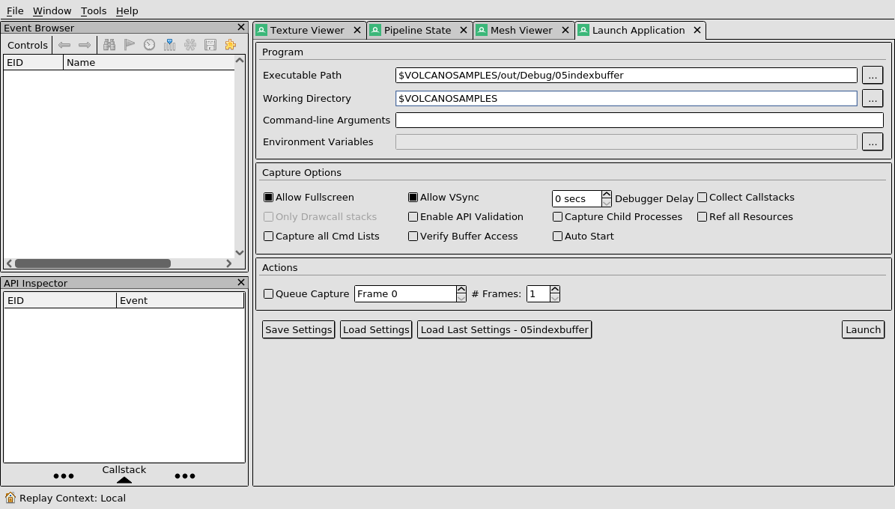
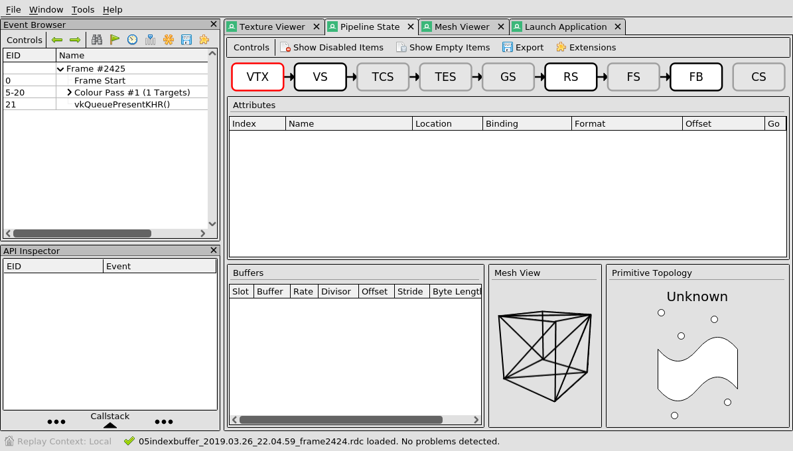
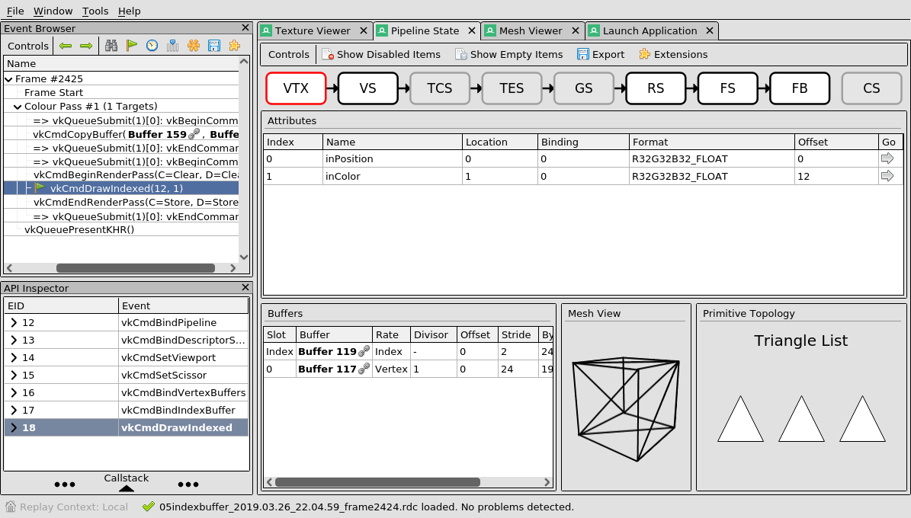
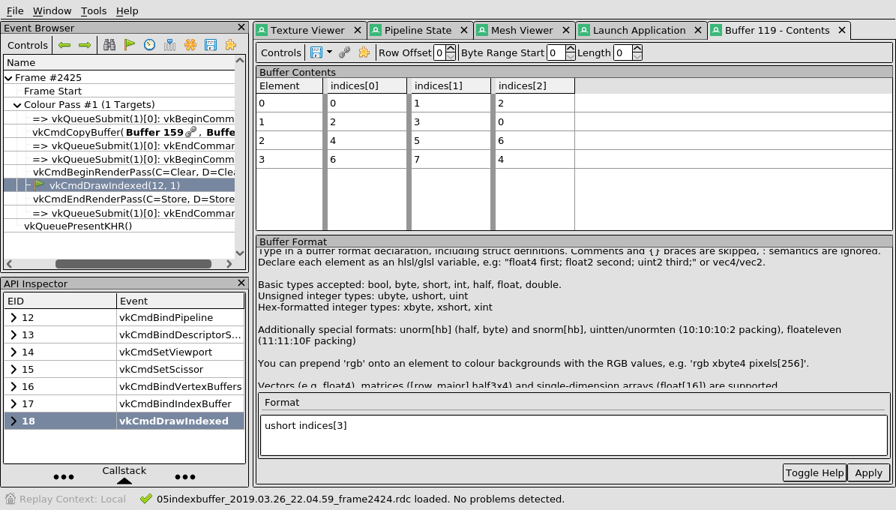
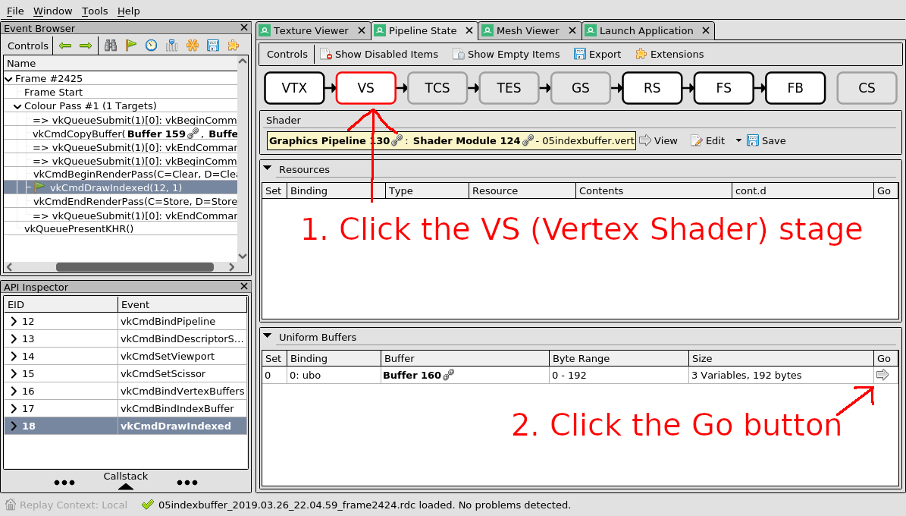

<table cellspacing="0" cellpadding="0"><tbody>
<tr valign="top"><td width="60%" colspan="2">

# Volcano Sample 5: The Index Buffer

This sample uses [Volcano](https://github.com/ndsol/volcano) to draw two
rotating squares on the screen, using most of the fixed-function stages of the
rendering pipeline.

</td></tr><tr valign="top"><td width="60%">

[View source code](./)

1. [Goals](#goals)
1. [Pipeline Stages](#pipeline-stages)
   1. [Index Buffers](#index-buffers)
   1. [RenderDoc](#renderdoc)
   1. [Uniform Buffers with App-Specific Types](#uniform-buffers-with-app-specific-types)
1. [Shader Reflection](#shader-reflection)
   1. [Caveat: Do not use `vec3` in certain cases](#shader-reflection-caveat-do-not-use-vec3-in-certain-cases)
   1. [Shader Attributes](#shader-attributes)
1. [Descriptor Sets, Writes, Pipelines, Binding and Layout](#descriptor-sets-writes-pipelines-binding-and-layout)
   * [Definition of Descriptor Set](#definition-of-descriptor-set)
   * [Definition of Descriptor Set Layout](#definition-of-descriptor-set-layout)
   * [Definition of Descriptor Set Write](#definition-of-descriptor-set-write)
   * [Definition of Layout Index](#definition-of-layout-index)
1. [Pipeline State Object](#pipeline-state-object)
1. [The End](#the-end)

</td><td width="40%">


[The top level README](https://github.com/ndsol/VolcanoSamples/) shows how to
build this sample.

Run this sample by typing:<br/>`out/Debug/05indexbuffer`

Vulkan Validation layers are enabled by setting the `VK_INSTANCE_LAYERS`
environment variable.</td></tr>
</tbody></table>

## Goals

This sample should teach you:

1. The Vulkan Pipeline Stages

1. How to use Shader Reflection

1. How to use Descriptor Sets, Descriptor Writes, and `binding = 0`

1. How to take a RenderDoc capture

## Pipeline Stages

If you compare the first few lines and last few lines of
[05indexbuffer.cpp](05indexbuffer.cpp) to
[Sample 4](../04android/04android.cpp), there is a lot in common:

* class `Example05` inherits from `BaseApplication`
* From `glfwSetWindowUserPointer(window, this);` to the last `#endif` is very
  similar. (Example05 skips the input event code, so it's a little shorter.)

[Sample 4](../04android/README.md) used the GPU only for line drawing. Each
pair of vertices in the vertex buffer made a line showing the location of one
finger or mouse pointer.

This sample shows a richer set of GPU features:

* An index buffer lets your app reuse each vertex in multiple polygons.
* A uniform buffer lets your app send app-specific custom data as inputs to
  your shaders.

A [quick review](https://fgiesen.wordpress.com/2011/07/09/a-trip-through-the-graphics-pipeline-2011-index/)
of the Vulkan
[pipeline stages](https://vulkan-tutorial.com/Drawing_a_triangle/Graphics_pipeline_basics)
may be helpful.

The GPU uses the pipeline stages to process large amounts of data in parallel.
That means the GPU wants lots of data flowing through each stage to keep the
entire pipeline busy. Really filling the GPU to capacity requires careful
optimization, a step that should be done very late in the design of your app.

But you have to learn about the GPU pipeline stages right up front in order
to create an app. Is there a way to get started without going too crazy
designing a super heavyweight app?

Digging into the problem, you first run into GPU pipeline stages because you
**must** write a GLSL shader to use Vulkan. The same is true if you use
OpenGL ES or DirectX. There's these two GLSL shaders. The first is the
**fragment** shader:

```C++
void main() {
  outColor = vec4(fragColor, 1);
}
```

This GLSL program (shown above) is what gets run in the sample here. It lacks
any sort of interesting algorithms. It just tells the GPU to use the color in
`fragColor` as the output color. And that's the end of the fragment shader
stage.

One thing it does is convert a 3-component vector to a 4-component vector. The
4th component is set to 1.

The other shader you **must** write is the **vertex** shader. Here it is:

```C++
void main() {
  gl_Position = ubo.proj * ubo.view * ubo.model * vec4(inPosition, 1.0);
  fragColor = inColor;
}
```

It sends `fragColor` to the fragment shader without much of anything happening
to it. Why are both shaders just passing along a color?

The vertex shader runs once for every vertex in the vertex buffer. This sample
has a vertex buffer with 8 vertices. That is not nearly enough to fill up a
GPU - resist the urge to create something that totally maxes out the GPU.

Here are all the vertices in the vertex buffer:

```C++
inPosition[0] =            inColor[0] =
    {{-0.5f, -0.5f, 0.0f},           {1.0f, 0.0f, 0.0f}},
inPosition[1] =            inColor[1] =
    {{0.5f, -0.5f, 0.0f},            {0.0f, 1.0f, 0.0f}},
inPosition[2] =            inColor[2] =
    {{0.5f, 0.5f, 0.0f},             {0.0f, 0.0f, 1.0f}},
inPosition[3] =            inColor[3] =
    {{-0.5f, 0.5f, 0.0f},            {1.0f, 1.0f, 1.0f}},

inPosition[4] =            inColor[4] =
    {{-0.5f, -0.5f, -0.5f},          {1.0f, 0.0f, 0.0f}},
inPosition[5] =            inColor[5] =
    {{0.5f, -0.5f, -0.5f},           {0.0f, 1.0f, 0.0f}},
inPosition[6] =            inColor[6] =
    {{0.5f, 0.5f, -0.5f},            {0.0f, 0.0f, 1.0f}},
inPosition[7] =            inColor[7] =
    {{-0.5f, 0.5f, -0.5f},           {1.0f, 1.0f, 1.0f}}};
```

The names `inPosition` and `inColor` are not in
[05indexbuffer.cpp](05indexbuffer.cpp). But the layout with `inPosition` first
and `inColor` second gets checked by the compiler in
[05indexbuffer.cpp](05indexbuffer.cpp):

```C++
// Shader reflection produces st_05indexbuffer_vert. This validates the
// vertices defined here against "inPosition" and "inColor" defined in the
// shader. The compiler can check that the vertices here match the expected
// vertex attributes in the shader.
//
// Shader reflection also produces UniformBufferObject
// (the type definition of the uniform buffer).
#include "05indexbuffer/struct_05indexbuffer.vert.h"
```

(Look for more on shader reflection below.)

The layout of all "in" variables comes from this code in the vertex shader:

```C++
// Specify inputs that vary per vertex (read from the vertex buffer).
// gl_VertexIndex is still defined as the vertex index (0 .. N).
layout(location = 0) in vec3 inPosition;
layout(location = 1) in vec3 inColor;
```

The outputs of the vertex shader must match the inputs of the fragment
shader. This code in the vertex shader defines "out" variables:

```C++
// Specify outputs.
out gl_PerVertex {
  vec4 gl_Position;
};
layout(location = 0) out vec3 fragColor;
```

Then this code in the fragment shader defines "in" variables:

```C++
// Specify inputs.
layout(location = 0) in vec3 fragColor;
```

Between the **vertex** stage and the **fragment** stage, the GPU has a
**fixed-function** stage called the **rasterizer.** Rasterization uses the
`gl_Position` spit out of the vertex shader and combines three positions
(to make a triangle) or four positions (to make a quad). This sample draws
triangles, so three positions are combined.

Rasterization is just filling all the pixels between the vertices. In short,
it **colors in the shapes** after the vertex shader set up the dot-to-dot.

Instead of calling them pixels, rasterization calls the output **fragments**.
After rasterization the **fragment shader** stage runs the GLSL program once
for each fragment. The fragment shader also gets as inputs any other data you
want. In this sample, `fragColor` is passed to the fragment shader.

The GPU either blends things between each vertex, which is what this sample
uses, or if the variable has the `flat` keyword, the GPU copies it without
doing any blending. This means the inputs to the fragment shader are either
linearly mixed or flat.

Specifically the GPU uses **linear interpolation** so the values in the
fragment shader are smoothly chosen from somewhere between the vertices
output from the vertex shader.


`fragColor` in each invocation of the fragment shader will not exactly match
any value from a vertex. Rather, it will be somewhere in between -
the vertex colors shown here are pure red, green, blue and white. The
colors in between are chosen by the **fixed-function** interpolation before
the fragment shader.

To wrap up this section, the question "Why?" above asked what happens to
`fragColor`. Although the vertex and fragment shader do nothing, rasterization
causes the value to be linearly interpolated between the colors for each
vertex. This happens just before the fragment shader runs.

### Index Buffers

This sample shows how to use an index buffer along with a vertex buffer.
Remember in [Sample 4](../04android/README.md) there was only a vertex buffer
without any index buffer.

The GPU uses the index buffer during the **input assembly** stage. This proves
very helpful if your app attaches lots of data to each vertex. Most 3D images
use the same vertex at least 3 times. The index buffer is used to tell the
GPU to reuse the vertex data. Otherwise, the vertex data would be repeated
many times, wasting memory and GPU time.

For example, vertex #55 might be used early, in the middle, and very late in
the drawing of the image. Any time 55 is encountered in the index buffer, the
GPU substitutes vertex #55 plus any additional data attached to vertex #55
like its color.

The GPU also lets you specify an `offset`, which adds a constant to the index
before looking it up in the vertex buffer, and an `indexBufOffset` which skips
some index buffer entries before starting to draw.

The GPU does the **input assembly** to go from indices in the index buffer to
vertices. Then the **vertex** stage feeds each vertex into your vertex shader.
There you can rotate or transform the vertices, but not make more vertices.
(Tessellation and Geometry Shaders can make more vertices but it turns out
that may not be as useful as it seems.)

The **rasterization** stage then draws the fragments contained in each
triangle or quad and interpolates any other values to be passed to the fragment
stage. The **fragment** stage runs your fragment shader. It may do early tests
to avoid needing your fragment shader for every fragment.

The **color blending** stage finally mixes each fragment with the output. The
output may be a frame buffer, an offscreen temporary buffer, a storage buffer,
a texture or something else. This stage can be told to just trash whatever was
already there, blend the two colors together, or even check which color has the
nearest Z-value (this is called depth testing).

The draw calls for this sample activate the GPU's entire pipeline. However, the
draw calls are recorded in a command buffer and only later executed on the
GPU. The actual drawing (which uses the GPU's pipeline) happens only once all
the necessary information has been attached to the GPU's pipeline - Vulkan
uses the word **bind** when the program is attaching information to feed the
pipeline.

First, the command buffer `cmdBuffer` enters the **recording** state:

```C++
if (cmdBuffer.beginSimultaneousUse() ||
```

The first actual command in the buffer starts a render pass:

```C++
    cmdBuffer.beginSubpass(pass, framebuf, 0) ||
```

A render pass can run either a compute pipeline or a graphics pipeline. This
one is a graphics pipeline. The pipeline `pipe0` is already set up as a
graphics pipeline with the vertex shader and fragment shader already loaded.
All that is left to do is bind the pipeline and the descriptor set for this
render pass:

```C++
    cmdBuffer.bindGraphicsPipelineAndDescriptors(
        *pipe0.pipe, 0, 1, &perFramebufDescriptorSet.at(framebuf_i)->vk) ||
```

The viewport and scissors are just set to the full size of the framebuffer.

```C++
    cmdBuffer.setViewport(0, 1, &viewport) ||
    cmdBuffer.setScissor(0, 1, &pipe0.info().scissors.at(0)) ||
```

Next this sample binds a vertex buffer to the render pass:

```C++
    cmdBuffer.bindVertexBuffers(0, sizeof(vertBufs) / sizeof(vertBufs[0]),
                                vertBufs, offsets) ||
```

The index buffer also needs to be bound. C++ allows the type of `indices` to
choose the correct `cmdBuffer.drawIndexed()` call - since `indices` is a
vector of `uint16_t` values, the shortcut `bindAndDraw()` correctly passes
`VK_INDEX_TYPE_UINT16` to `bindIndexBuffer()`. Then it calls
`drawIndexed()` for you.

```C++
    cmdBuffer.bindAndDraw(indices, indexBuffer.vk, 0 /*indexBufOffset*/) ||
```

There's no more work to be done for this render pass, so end the render pass.

```C++
cmdBuffer.endRenderPass() ||
```

Then tell the command buffer to exit the **recording** state.

```C++
cmdBuffer.end()) {
```

The completed command buffer can now be submitted to the GPU to render an
entire frame. This happens in the `redrawError()` function:

```C++
if (cmdBuffers.at(nextImage).enqueue(lock, sub)) { ... }
...
if (cpool.submit(lock, stage.poolQindex, {sub}, renderDoneFence.vk) ||
    renderSemaphore.present(&nextImage)) { ... }
```

The GPU only **starts** working on the `cmdBuffer` when `submit()` is called.
That is part of why `renderDoneFence` and `renderSemaphore` must be used to
synchronize with the GPU. They let the CPU know when the GPU has **finished**
processing `cmdBuffer`.

### RenderDoc

[RenderDoc](https://renderdoc.org) helps answer the question, "why did the
GPU draw that?" It is not a full source-level debugger because it uses
a capture of the vulkan commands your app executed. It doesn't know where the
source code in your app was that led to those commands.

Please try out RenderDoc to see the GPU pipeline in action!

Download and install it at
[https://renderdoc.org](https://renderdoc.org).

> Note: On Linux, use the command line to set LD_LIBRARY_PATH first:
>
> First cd to the directory where your VolcanoSamples git checkout lives:
> ```
> cd $VOLCANOSAMPLES
> ```
>
> Then export LD_LIBRARY_PATH and launch RenderDoc:
> ```
> export LD_LIBRARY_PATH=$PWD/out/Debug
> qrenderdoc
> ```

Try launching RenderDoc and navigating to the "Launch Application" tab. In the
Executable Path field put in this sample: `out/Debug/05indexbuffers`



> NOTE: Please replace $VOLCANOSAMPLES with where your VolcanoSamples git
> checkout lives.

Click **Launch** and use **F12** or **PrintScreen** to capture a frame.

Close the window of spinning quads to get to your captured frame in
RenderDoc. Navigate to the "Pipeline State" tab to see this:



This shows the GPU pipelines in their empty state. On the left, expand
**events 5-20 (Pass #1)** and click on `vkCmdDrawIndexed(12, 1)`:



To inspect the index buffer, look in the "Buffers" pane at the bottom. Click
on the row `Index | Buffer 119 | Index |` to open **Buffer 119 - Contents**:



Take a look around. Can you find a tab where VTX (vertex) and IDX (index)
values are combined to make the quads?

### Uniform Buffers with App-Specific Types

The [`glm`](https://glm.g-truc.net) library makes its appearance in this
sample. The shader reflection automatically generates a header file that
can tell if your app #includes `glm`. The header looks like this:

```C++
#ifndef GLM_VERSION_MAJOR
... glm not available, use plain C++ types ...
#else
... glm is available, use glm types ...
#endif
```

Take a look by typing:
`less out/Debug/gen/05indexbuffer/struct_05indexbuffer.frag.h`

(On Windows:
`type out\Debug\gen\05indexbuffer\struct_05indexbuffer.frag.h`)

If you were hoping the shader reflection would spit out a header file with
glm types but it doesn't, check your GLSL code - `glm` most likely does not
support the types of variables you are using.)

The shader reflection reads this (from 05indexbuffer.vert):

```C++
// Specify inputs that are constant ("uniform") for all vertices.
// The uniform buffer is updated by the app once per frame.
layout(binding = 0) uniform UniformBufferObject {
  mat4 model;
  mat4 view;
  mat4 proj;
} ubo;
```

And spits out this (in
out/Debug/gen/05indexbuffer/struct_05indexbuffer.vert.h):

```C++
struct UniformBufferObject {
    #ifndef GLM_VERSION_MAJOR /* glm not available */
    float model [4][4];
    #else /* ifdef GLM_VERSION_MAJOR then use glm */
    glm::mat4x4 model;
    #endif /* GLM_VERSION_MAJOR */

    #ifndef GLM_VERSION_MAJOR /* glm not available */
    float view [4][4];
    #else /* ifdef GLM_VERSION_MAJOR then use glm */
    glm::mat4x4 view;
    #endif /* GLM_VERSION_MAJOR */

    #ifndef GLM_VERSION_MAJOR /* glm not available */
    float proj [4][4];
    #else /* ifdef GLM_VERSION_MAJOR then use glm */
    glm::mat4x4 proj;
    #endif /* GLM_VERSION_MAJOR */
};
```

You use glm by listing glm in BUILD.gn. The `deps` section looks like this:

```
import("//src/gn/vendor/glslangValidator.gni")
import("//src/gn/vendor/androidExecutable.gni")

glslangVulkanToHeader("shaders") {
  sources = [
    "05indexbuffer.vert",
    "05indexbuffer.frag",
  ]
}

androidExecutable("05indexbuffer") {
  sources = [ "05indexbuffer.cpp" ]

  deps = [
    ":shaders",
    "../src:base_application",
    "//src/gn/vendor/glm", # Add glm here
  ]
}
```

Ok, this sample has a `UniformBufferObject` and it has the right
#include to pull it in:

`#include "05indexbuffer/struct_05indexbuffer.vert.h"`

What does it do next? Look at the code in `buildUBO`:

```C++
void buildUBO(UniformBufferObject& ubo, float time) {
  ubo.model = glm::rotate(glm::rotate(glm::mat4(1.0f), glm::radians(40.0f),
                                      glm::vec3(0.0f, 1, 0)),
                          time * glm::radians(90.0f), glm::vec3(0.0f, 0, 1));

  ubo.view = glm::lookAt(glm::vec3(2.0f, 0, 0),      // Object pose.
                          glm::vec3(0.0f, 0, -0.23),  // Camera pose.
                          glm::vec3(0.0f, 0, 1));     // Up vector.

  ubo.proj = glm::perspective(glm::radians(45.0f), cpool.vk.dev.aspectRatio(),
                              0.1f, 10.0f);

  // convert from OpenGL where clip coordinates +Y is up
  // to Vulkan where clip coordinates +Y is down. The other OpenGL/Vulkan
  // coordinate change is GLM_FORCE_DEPTH_ZERO_TO_ONE. For more information:
  // https://github.com/LunarG/VulkanSamples/commit/0dd3617
  // https://forums.khronos.org/showthread.php/13152-Understand-Vulkan-Clipping
  // https://matthewwellings.com/blog/the-new-vulkan-coordinate-system/
  // https://www.khronos.org/registry/vulkan/specs/1.0/html/vkspec.html#vertexpostproc-clipping
  ubo.proj[1][1] *= -1;
}
```

RenderDoc can show you `ubo`: navigate to the "Pipeline State" tab.
Click on the **VS** stage (Vertex Shader). The "Uniform Buffers" pane at the
bottom lists Descriptor Set 0, Binding 0: "ubo". Click the "Go" arrow to
see its contents.



## Shader Reflection

You may have questions about Shader Reflection from
[Sample 4](../04android/README.md). This sample covers it more thoroughly. Keep
in mind that `memory::DescriptorSet` is a perfectly acceptable way of creating a
`VkDescriptorSet`. But the `science::ShaderLibrary` does shader reflection to
help keep your app simple, producing a `memory::DescriptorSet` automatically.

`science::ShaderLibrary` scans all the shaders given to it using the
[SPIRV-Cross](https://github.com/KhronosGroup/SPIRV-Cross) library.

```C++
  auto vert = std::make_shared<command::Shader>(dev);
  auto frag = std::make_shared<command::Shader>(dev);
  if (vert->loadSPV(spv_05indexbuffer_vert, sizeof(spv_05indexbuffer_vert)) ||
      frag->loadSPV(spv_05indexbuffer_frag, sizeof(spv_05indexbuffer_frag)) ||
```

[Reflection](https://en.wikipedia.org/wiki/Reflection_%28computer_programming%29)
extracts the correct `VkDescriptorSetLayoutBinding`, `VkDescriptorType`, and
other structures Vulkan requires. This saves you from manually coding each
shader variable in multiple places:
[Don't Repeat Yourself](https://en.wikipedia.org/wiki/Don%27t_repeat_yourself).

Most importantly, this saves you from debugging render pass failures that might
be caused by a typo.

There are some things you should be aware of though:

### Shader Reflection Caveat: Do not use `vec3` in certain cases

[Nicol Bolas](https://stackoverflow.com/a/38172697/734069) helpfully points
out a problem with `vec3` in Uniform Buffers, SSBOs, and Push Constant Buffers.
The `vec3` type has a memory layout that can lead to hard-to-debug buffer
overrun issues.

Just use a `vec4` in place of a `vec3` in Uniform Buffers, SSBOs, and Push
Constants, which will have the right layout. An advanced option is to require
`VK_EXT_scalar_layout` and add the scalar keyword:
`layout(binding = N, scalar)`.

### Shader Attributes

Shader attributes are the type info extracted from the shader by reflection.

For instance, the vertex input may be a `vec2`, or a whole structure with
several `vec4` types inside it.

Similarly, a uniform buffer can contain pretty much any type Vulkan supports.

Vulkan requires your app to specify the types being provided as input to each
pipeline, as well as the types being passed from one pipeline stage to another.

`VkVertexInputBindingDescription` and `VkVertexInputAttributeDescription` are
extracted by shader reflection. You can check what the shader reflection
produced with:

```
less out/Debug/gen/05indexbuffer/struct_05indexbuffer.vert.h
```

(Windows reminder: replace `less` with `type`)

Shader reflection generates a header file from each GLSL input. The header
file has shader attributes, C++ type definitions and some useful inline
functions. The SPIR-V compiler also generates a header file which just has
a big array in it of SPIR-V bytecode.

The header files are generated by the `glslangVulkanToHeader` rule in
`BUILD.gn`. Then the C++ code can #include it like this:
`#include "05indexbuffer/struct_05indexbuffer.vert.h"`

Shader Reflection is useful to:

* Stop duplicating GLSL definitions.
* Reduce typos. Reduce bugs.
* Use full type definitions everywhere so the compiler can type-check
  everything.
* Automatically generate Vulkan code such as
  `VkVertexInputBindingDescription` and `VkVertexInputAttributeDescription`.

<details>
<summary><b>Q:</b> Why do I get a `redefinition of struct` error? [Click to
expand]</summary>

**Answer:** A weakness of GLSL is that it does not have the concept of an
`#include` directive. (See "shaderc" for one solution to this.)

A vertex shader + fragment shader pair will need to define the Uniform Buffer
- this is duplication of code.

When the auto-generated headers are both brought into 05indexbuffer.cpp,
in this manner:

```
`#include "05indexbuffer/struct_05indexbuffer.vert.h"`
`#include "05indexbuffer/struct_05indexbuffer.frag.h"`
```

The result is a `redefinition of struct` error on `UniformBufferObject`.

Well, it **is** defined in both places. Which one is the right one?

It turns out neither are wrong. Both are right. Here is how to include both
in one C++ file:

```
// Import shader reflection types in separate namespaces.
namespace vert {
#include "05indexbuffer/struct_05indexbuffer.vert.h"
}

namespace frag {
#include "05indexbuffer/struct_05indexbuffer.frag.h"
}

// Your code now has access to both vert::UniformBufferObject and
// frag::UniformBufferObject. It turns out they are identical.
```

</details>

## Descriptor Sets, Writes, Pipelines, Binding and Layout

Take a close look at the Descriptor Set code. It is short but important:

The `ShaderLibrary` sums up all the shader code to figure out what all the
inputs and outputs are. First you should call `shaders.add()` for all the
shaders used in the render pass. Then tell the ShaderLibrary you are ready
for it to spit out the reflection data by calling
`shaders.finalizeDescriptorLibrary(descriptorLibrary)`.

```C++
std::vector<command::CommandBuffer> cmdBuffers;
// shaders is a ShaderLibrary tracking all the shaders the app has loaded.
science::ShaderLibrary shaders{cpool.dev};
// descriptorLibrary is the final output of the ShaderLibrary.
science::DescriptorLibrary descriptorLibrary{cpool.dev};
// perFramebufDescriptorSet maps one DescriptorSet to each framebuf. There
// must be a different DescriptorSet for each because the GPU might still be
// using the previous DescriptorSet when rendering starts on the next frame.
// cmdBuffers also maps one CommandBuffer to each framebuf. Hopefully this
// pattern is becoming familiar to you.
std::vector<std::shared_ptr<memory::DescriptorSet>> perFramebufDescriptorSet;
...
  // Read compiled-in shaders from app into Vulkan.
  auto vert = std::make_shared<command::Shader>(dev);
  auto frag = std::make_shared<command::Shader>(dev);
  if (vert->loadSPV(spv_05indexbuffer_vert, sizeof(spv_05indexbuffer_vert)) ||
      frag->loadSPV(spv_05indexbuffer_frag, sizeof(spv_05indexbuffer_frag)) ||
      shaders.add(pipe0, vert) || shaders.add(pipe0, frag)) {
    return 1;
  }
...
         shaders.finalizeDescriptorLibrary(descriptorLibrary) ||
         onResized(dev.swapChainInfo.imageExtent, memory::ASSUME_POOL_QINDEX);
}
```

After putting the shader inputs and outputs into `descriptorLibrary`, you can
use the `descriptorLibrary` immediately to make as many copies of its layout as
you want. You make copies by creating Descriptor Sets.

This sample uses only one Descriptor Set for a uniform buffer. But here is as
good a place as any to talk more about Descriptor Sets.

#### Definition of Descriptor:

A Descriptor is a pointer. On the CPU, all you have is a handle. The actual
pointer only exists on the GPU. The GPU driver keeps track of the pointer and
returns a handle which you can use to refer to the pointer.

Your app can't directly access GPU memory (unless it is "host visible"). Thus
your app makes an API call such as `DescriptorSet::write()` with a handle,
usually called `vk`. The GPU driver replaces the handle with the pointer in
GPU space.

Since your app is most likely going to have more than one pointer, there aren't
any API functions for dealing with just one Descriptor at a time. Instead,
your app puts together all the Descriptors it will need into a Descriptor Set.

#### Definition of Descriptor Set:

A Descriptor Set is a vector of GPU pointers.

In this sample, there's just one Descriptor Set. It has just one pointer,
pointing to a uniform buffer.

This sample uses a separate uniform buffer for each frame buffer (similar to
how the command buffers need to be distinct). There is one Descriptor Set for
each frame buffer and there is one command buffer for each frame buffer. The
Descriptor Set (containing only one Descriptor) gets written to the
command buffer here:

```C++
  // If this framebuffer has not had a uniform buffer set up yet, then:
  if (framebuf_i >= perFramebufUniform.size()) {
    // Add to the vector of uniform buffers.
    perFramebufUniform.emplace_back(cpool.vk.dev);
    auto& uniformBuf = perFramebufUniform.back();
    uniformBuf.info.size = sizeof(UniformBufferObject);
    uniformBuf.info.usage |= VK_BUFFER_USAGE_UNIFORM_BUFFER_BIT;
    if (uniformBuf.ctorAndBindDeviceLocal()) {
      ... handle errors ...
    }

    std::shared_ptr<memory::DescriptorSet> ds = descriptorLibrary.makeSet(0);
    if (!ds) {
      ... handle errors ...
    }
    perFramebufDescriptorSet.push_back(ds);
    if (ds->write(bindingIndexOfUniformBufferObject(),
                  {&perFramebufUniform.back()})) {
      ... handle errors ...
    }
  }
```

#### Definition of Descriptor Set Layout:

Even though this sample uses one Descriptor Set per frame buffer, all the
Descriptor Sets contain exactly the same **layout**.

A Descriptor Set Layout is a Vulkan object with a list of type signatures, one
for each pointer in the Descriptor Set. This sample's Descriptor Sets all
contain exactly one Descriptor which points to a Uniform Buffer. Thus the
Descriptor Set Layout is a list of type signatures of size 1. In
pseudocode:

```
Descriptor Set Layout {
  Descriptor Sets with this Descriptor Set Layout have exactly 1 pointer.

  List of type signatures:
  1. A Descriptor pointing to a Uniform Buffer.
}
```

For example, a different Descriptor Set might contain some texture samplers.
The Descriptor Set Layout might look like this in pseudocode:

```
Descriptor Set Layout {
  Descriptor Sets with this Descriptor Set Layout have exactly 3 pointers.

  List of type signatures:
  1. A Descriptor pointing to a 2D Texture Sampler.
  2. A Descriptor pointing to a Uniform Buffer.
  3. A Descriptor pointing to a Cube Map Texture Sampler.
}
```

Vulkan requires your app to start by setting up a Descriptor Layout, then
create one or more Descriptor Sets from it using a Descriptor Pool, then
write pointers into the Descriptor Sets, bind Descriptor Sets and Shaders to a
Pipeline and Render Pass, then record command buffers and submit the
render pass to Vulkan.

Volcano hopefully simplifies that a little:

1. Call `ShaderLibrary::add()` until you run out of shaders.
1. Call 'ShaderLibrary::finalizeDescriptorLibrary()` to walk all the shaders
   for their Descriptor Layouts.
1. Make DescriptorSet objects from the shiny new Descriptor Library:

```C++
    std::shared_ptr<memory::DescriptorSet> ds = descriptorLibrary.makeSet(0);
```

Here is how to write the uniform buffer handle into the Descriptor Set:

```C++
    if (ds->write(bindingIndexOfUniformBufferObject(),
                  {&perFramebufUniform.back()})) {
```

#### Definition of Descriptor Set Write

When your app "writes a Descriptor Set," your app gives a Vulkan handle
to be put in the Descriptor Set. The GPU driver can translate the Vulkan handle
into a GPU space pointer.

Shader reflection conveniently provides a `bindingIndexOf...()` function
for each GLSL object that can be written to a Descriptor Set. In this
sample, this auto-generated file defines the function:
`#include "05indexbuffer/struct_05indexbuffer.vert.h"`.

The shader defined `UniformBufferObject` here:
```C++
// Specify inputs that are constant ("uniform") for all vertices.
// The uniform buffer is updated by the app once per frame.
layout(binding = 0) uniform UniformBufferObject {
  mat4 model;
  mat4 view;
  mat4 proj;
} ubo;
```

The `binding = 0` layout can be accessed in C++ by calling
`bindingIndexOfUniformBufferObject()`.

This C++ code uses it:

```
ds->write(bindingIndexOfUniformBufferObject(), {&perFramebufUniform.back()})
```

In English the above code is translated as:
1. The app wants to put something in Descriptor Set `ds`.
1. A uniform buffer was allocated by the C++ code. The Vulkan handle is
   in this vector of memory::Buffer objects:
   `perFramebufUniform.back()`.
1. The shader called the buffer `UniformBufferObject`. Rather than
   hard-code the value of `binding = 0`, the C++ code merely uses the name of
   the object in the GLSL code (UniformBufferObject) to call the function
   named `bindindIndexOfUniformBufferObject()`.

#### Definition of Layout Index

[Sample 7](../07mipmaps/README.md),
[Sample 8](../08specialization/README.md), and
[Sample 9](../09fullscreen/README.md) use Dear ImGui. It has another
Descriptor Set to run the Dear ImGui shaders.

How do we keep track of its shaders? They have very different inputs and
outputs. It would be impossible to use one Descriptor Layout for both
the Dear ImGui shaders and your app's own shaders.

The answer is to use more than one Descriptor Set Layout at a time. Your app
gets Layout Index 0 (up to as high a number as it wants, unless it exceeds the
limits in Vulkan). Then to figure out a different Layout Index to give ImGui,
this code adds one:

```C++
// maxLayoutIndex: if UniformGlue wants to create a new layout (for ImGui),
// it will use the layout index maxLayoutIndex + 1. maxLayoutIndex is also
// assumed to be the layout containing the uniform buffer and
// initPipeBuilderFrom() assumes maxLayoutIndex is the layout for pipe.
UniformGlue(BaseApplication& app, GLFWwindow* window,
            size_t maxLayoutIndex, unsigned uboBindingIndex, size_t uboSize);
```

[Sample 7](../07mipmaps/README.md) uses RenderDoc to inspect the different
Descriptor Set Layouts visually. Head on over there for more info.

## Pipeline State Object

The concepts explained above come together to make a Pipeline State Object.
If the entire Vulkan pipeline were just a single shader program, the
Pipeline State Object would be very simple: it would just hold the program.

(This is exactly what a compute shader does.)

GPU pipelines have several stages, including some **fixed-function** stages.
The fixed function stages in the pipeline do not use a Descriptor Set. Instead
of writing a pointer to the data via a Descriptor Set, the pointer to the
vertex buffer is written with `bindVertexBuffers`.

The pointer to the index buffer is written with `bindAndDraw` (as a shortcut
instead of having to call `bindIndexBuffer`). Because these are fixed
function stages in the pipeline, they are fed in a special way.

On the other hand, shader inputs and outputs are more flexible. They require
your app to describe the Descriptor Layout when you write a pointer to their
input and output buffers. Your app must bind a Descriptor:

```C++
cmdBuffer.bindGraphicsPipelineAndDescriptors(
    *pipe0.pipe, 0, 1, &perFramebufDescriptorSet.at(framebuf_i)->vk)
```

`command::Pipeline::setLayouts` in `pipe0` is a vector of all the descriptor
set layouts in `pipe0`. In this example, there is just one descriptor set
layout. The pipeline can then be run with *any matching descriptor set* when
`bindGraphicsPipelineAndDescriptors` is called. In this example, there is one
per frame at `descriptorSet.at(framebuf_i)`.

[The next sample](../06threepipelines) demonstrates how to use diferent
pipelines during a Render Pass.

It also loads a more complex model file showing how the index and vertex
buffers are used for a real 3D model.

## The End

Hopefully at this point you are comfortable with:

1. Shader reflection
1. `glm`
1. Descriptor Sets
1. Descriptor Set Writes
1. Descriptor Set "binding = 0"
1. Layout Index
1. Binding a Descriptor Set to a Pipeline State Object
1. Binding a different Descriptor Set to the same Pipeline State Object
1. Index buffers
1. Vertex buffers
1. Uniform buffers
1. GPU Pipeline stages
1. RenderDoc captures

Whew! There's a lot going on here!

Please take some time to tinker with the app. See what you can create using
just the tools presented this far. Explore.

### Homework

Assume that Vulkan apps typically have more than one pipeline and the app will
decide to stop using pipeline #1 and use pipeline #2 halfway through.

* Why would it be useful for multiple pipelines to have exactly matching
descriptor set layouts?

* How many descriptor sets would be required if the app had 5 pipelines and
3 framebuffers, each pipeline needing a different descriptor layout? How could
that be optimized?

Assume the app's pipelines are complicated enough that it's worth splitting
the descriptor layout into two "layout index" values.

* Does the app need exactly double the number of descriptor sets?

* Could several pipelines share a layout more easily this way?

Could a single descriptor set be shared between many pipelines if it no longer
had to contain the things that change with each framebuffer?

Copyright (c) 2017-2018 the Volcano Authors. All rights reserved.
