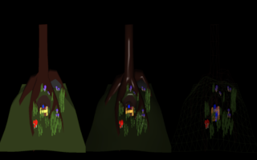
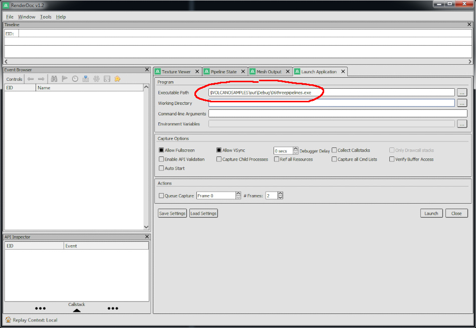

<table cellspacing="0" cellpadding="0"><tbody>
<tr valign="top"><td width="60%" colspan="2">

# Volcano Sample 6: Three Pipelines

This sample shows multiple subpasses within a RenderPass. The
`vkCmdNextSubpass` function can be called using several shortcut forms:

1. The thinnest one is simply
   `CommandBuffer::nextSubpass(VkSubpassContents)`
1. A convenient shortcut, `CommandBuffer::beginSubpass()`, calls
   `nextSubpass(commandBufferType)` retrieving the subpass type from the
   pipeline state object. It then calls `beginRenderPass()` for you.

</td></tr><tr valign="top"><td width="60%">

[View source code](./)

1. [Goals](#goals)
1. [Wireframe Mode](#wireframe-mode)
1. [Pipeline State](#pipeline-state)
1. [Cel Shading (Toon Shading)](#cel-shading-toon-shading)
1. [The assimp library](#the-assimp-library)
1. [UniformGlue](#uniformglue)
   1. [GLFW functions moved into UniformGlue](#glfw-functions-moved-into-uniformglue)
   1. [Example06 constructor](#example06-constructor)
1. [Pipeline Derivatives](#pipeline-derivatives)
1. [Android Tips](#android-tips)
1. [RenderDoc](#renderdoc)
1. [The End](#the-end)

</td><td width="40%">



This sample is not automatically built.

Build it by typing: (all on one line)<br/>
`vendor/subgn/ninja -C out/Debug 06threepipelines`

Run it by typing:<br/>`out/Debug/06threepipelines`

Vulkan Validation layers are enabled by setting the `VK_INSTANCE_LAYERS`
environment variable.</td></tr>
</tbody></table>

## Goals

This sample will go through the following subjects:

1. Create an app with several pipeline states all displayed at the same time
   (Pipeline state objects are not the same thing as GPU pipeline stages.)
1. Why Vulkan stores state in pipeline state objects
1. Load a 3D model using assimp
1. How to use the `UniformGlue` class to simplify the app
1. More RenderDoc tips
1. Android optimizations

## Wireframe Mode

When the Instance creates the Device, some features are not automatically
enabled. To request a feature, `createApp` has a bit of extra code to request
it, then `run()` checks whether `Instance::open()` was able to successfully
enable it:

```C++
// Request features here, verify success above.
dev.enabledFeatures.set("fillModeNonSolid", VK_TRUE) ||
dev.enabledFeatures.set("wideLines", VK_TRUE) ||
```

Later:

```C++
if (i == 2 && !enabledFeatures.fillModeNonSolid) {
  // Device does not support wireframe.
  // End the subpass immediately.
  continue;
}
```

Not all Vulkan devices support wireframe mode, but if it's supported, this
sample displays it. Enabling wireframe mode requires a separate subpass and
pipeline state. Thus this sample shows how to render several subpasses at the
same time.

## Pipeline State

OpenGL allows you to start drawing in wireframe mode with a simple
`glBegin(GL_LINES)`. This does not map well to how modern GPUs work.

Vulkan is a low-level, verbose API. This maps well to how modern GPUs work.
The Vulkan GPU driver does not need to guess what your app is doing, because
everything is so explicit.

One major part of that explicit, verbose API is the concept of a pipeline.
Each time your app makes state changes (such as enabling wireframe mode),
your app must create a separate pipeline. To execute the pipeline requires a
separate subpass.

That's where the state changes happen - in the pipeline state.

Be careful not to confuse **pipeline state objects** with the
**GPU's pipeline stages** (explained in more detail in
[Sample 5](../05indexbuffer/README.md)
). Pipeline state objects (or PSOs for short) are used to turn things on
or off like wireframe mode. The GPU pipeline stage for **rasterization** is a
fixed-function stage but it does have a few configuration parameters. One
is whether to rasterize to lines instead of filled triangles. To use Vulkan,
your app defines the rasterization state using
`VkPipelineRasterizationStateCreateInfo rastersci;`

The code in this sample to set up wireframe mode looks like this:

```C++
if (cpool.vk.dev.enabledFeatures.features.fillModeNonSolid) {
  pipes.at(2).info().rastersci.polygonMode = VK_POLYGON_MODE_LINE;
}
```

## Cel Shading (Toon Shading)

Since this sample does a few render passes, it also has one to show
a "cartoony" brightness value. This one computes the lighting equation
brightness value, I:

```C++
float I = dot(fragNormal, normalize(fragLightVec));
```

Then the I value is converted to a Y value with several step functions:

```C++
float Y = 0.8 + step(-0.2, I) * 1.2 + step(0.1, I);
```

This is exactly the same as:

* Using a lookup table
* Using a 1D texture
* Using several if() statements.

A 1D texture might be useful if your app changes the lighting equation
dynamically, without recompiling the shader.

Using a compiled-in formula as this sample does keeps the app simple and
keeps the memory bandwidth to a minimum. There are pros and cons to each
approach.

Cel Shading can become **very** complicated very quickly, as
[this video](https://www.youtube.com/watch?v=yhGjCzxJV3E) demonstrates.

## The assimp library

Unlike previous samples, this sample uses another dependency:
[assimp](https://github.com/assimp/assimp). When you're ready to try it out,
follow the instructions above to compile and run this example.

The function responsible for copying the model from assimp's data structures
and writing the data into the vertex and index buffers looks like this:

```C++
// Data import/conversion: load scene, copy data into vertices and indices.
int importMesh() {
  const aiScene* scene;
  AssimpGlue assimp;
  if (assimp.import("treasure_smooth.assbin", &scene)) {
    return 1;
  }
  for (unsigned i = 0; i < scene->mNumMeshes; i++) {
    const aiMesh* mesh = scene->mMeshes[i];
    aiColor3D c(0.f, 0.f, 0.f);
    scene->mMaterials[mesh->mMaterialIndex]->Get(AI_MATKEY_COLOR_DIFFUSE, c);
    // Skip scene->mMaterials[]->GetTextureCount(aiTextureType_DIFFUSE) and
    // GetTexture(aiTextureType_DIFFUSE, 0 .. texture_count, ...) for now.

    for (unsigned i = 0; i < mesh->mNumVertices; i++) {
      aiVector3D* meshVertex = &(mesh->mVertices[i]);
      aiVector3D* meshNormal = &(mesh->mNormals[i]);
      // convert aiVector3D from OpenGL to Vulkan by flipping y.
      vertices.emplace_back(st_06threepipelines_vert{
          {meshVertex->x, -meshVertex->y, meshVertex->z},  // inPosition
          {meshNormal->x, -meshNormal->y, meshNormal->z},  // inNormal
          {c.r, c.g, c.b},                                 // inColor
      });
    }

    uint32_t offset = static_cast<uint32_t>(uglue.indices.size());
    for (unsigned i = 0; i < mesh->mNumFaces; i++) {
      const aiFace& face = mesh->mFaces[i];
      if (face.mNumIndices != 3) {
        continue;
      }
      uglue.indices.push_back(offset + face.mIndices[0]);
      uglue.indices.push_back(offset + face.mIndices[1]);
      uglue.indices.push_back(offset + face.mIndices[2]);
    }
  }
  return 0;
}
```

Assimp's data structures are nested and this function unpacks all the
nested faces and writes them sequentially to vertex and index buffers so the
GPU can draw it all in a single render pass.

## UniformGlue

This example introduces the `UniformGlue` class. It contains a lot of the same
member variables [Sample 5](../05indexbuffer/README.md) used. By factoring out
the repeated stuff into a glue class, this sample is simpler to read.

However, when you want to take a look at what's inside the `uglue` member,
head over to [its header file](../src/uniform_glue.h):

```C++
science::ShaderLibrary shaders{app.cpool.vk.dev};
science::DescriptorLibrary descriptorLibrary{app.cpool.vk.dev};
std::vector<std::shared_ptr<memory::DescriptorSet>> descriptorSet;
std::vector<memory::Buffer> uniform;
memory::Stage stage{app.cpool, memory::ASSUME_POOL_QINDEX};
memory::Buffer vertexBuffer{app.cpool.vk.dev};
memory::Buffer indexBuffer{app.cpool.vk.dev};
std::vector<uint32_t> indices;
command::Semaphore imageAvailableSemaphore{app.cpool.vk.dev};
command::Fence renderDoneFence{app.cpool.vk.dev};
std::vector<science::SmartCommandBuffer> cmdBuffers;
Timer elapsed;
GLFWwindow* window;
```

**NOTE:** UniformGlue is under VolcanoSamples/src. This isn't part of Volcano
and may not work for your app, but it does a lot to keep the samples simple,
short and sweet. The main idea is to separate the repetitive background noise
from the really interesting bits of each sample.

Some methods also help reduce the clutter in the main app:

* `UniformGlue::windowShouldClose()`
* `UniformGlue::buildPassAndTriggerResize()`
* `UniformGlue::endRenderPass()`
* `UniformGlue::submit()`
* `UniformGlue::initPipeBuilderFrom()`

### GLFW functions moved into UniformGlue

This sample calls `UniformGlue::windowShouldClose()` instead of
glfwWindowShouldClose().

Other GLFW code has moved into UniformGlue, such as window and input callbacks.
This sample can then call one function,
`UniformGlue::buildPassAndTriggerResize()` which sets up all the callbacks.

Although UniformGlue may not be a perfect fit for your app, it's a good
example of abstracting away common code to avoid needing to repeat yourself.

Some OS's such as Windows and macOS have odd behavior when the window is
resized - they block the main event loop inside glfwWindowShouldClose()
(which is inside `UniformGlue::windowShouldClose()`). GLFW works around this
by defining a callback to repaint the window - take a look at
`UniformGlue::onGLFWRefresh()`.

GLFW will call it from surprising places (such as inside
`UniformGlue::windowShouldClose()`), but it also makes the app a little
simpler. UniformGlue takes care of acquiring the image and presenting it to
the framebuffer. This sample then only needs to update the uniform buffer
and submit the GPU commands to repaint the window.

This line in the constructor tells the `UniformGlue` class what to do when
GLFW wants the window to be repainted:

```C++
uglue.redrawListeners.emplace_back(std::make_pair(
    [](void* self, std::shared_ptr<memory::Flight> flight) -> int {
      return static_cast<Example06*>(self)->redraw(flight);
    },
    this));
```

Then this sample's `redraw()` method submits the rendering commands to the
GPU and updates the uniform buffer.

There are some interesting things going on with the
`std::shared_ptr<memory::Flight> flight`, covered in more detail in
[Sample 7](../07mipmaps/README.md).

### Example06 constructor

Take a close look at the top of the constructor. This tells `UniformGlue` how
large of a uniform buffer to allocate for this app:
```C++
Example06(language::Instance& instance, GLFWwindow* window)
    : BaseApplication{instance},
      uglue{*this, window, 0 /*maxLayoutIndex*/,
            bindingIndexOfUniformBufferObject(),
            sizeof(UniformBufferObject)} {
  resizeFramebufListeners.emplace_back(std::make_pair(
      [](void* self, language::Framebuf& framebuf, size_t fbi,
          size_t) -> int {
        return static_cast<Example06*>(self)->buildFramebuf(framebuf, fbi);
      },
      this));
```

The GLFW input handling code that was used in
[Sample 4](../04android/README.md) has ... moved into UniformGlue! This sample
only needs to define a few functions, `onInputEvent` and `onModelRotate`. 
Then UniformGlue provides an observer pattern with
`inputEventListeners` and `keyEventListeners`:

```C++
  uglue.keyEventListeners.push_back(std::make_pair(
      [](void* self, int key, int /*scancode*/, int action,
         int /*mods*/) -> void {
        if (action != GLFW_PRESS && action != GLFW_REPEAT) {
          return;
        }
        static_cast<Example06*>(self)->onModelRotate(
            key == GLFW_KEY_LEFT ? -10 : (key == GLFW_KEY_RIGHT ? 10 : 0),
            key == GLFW_KEY_UP ? -10 : (key == GLFW_KEY_DOWN ? 10 : 0));
      },
      this));
  uglue.inputEventListeners.push_back(std::make_pair(
      [](void* self, GLFWinputEvent* e, size_t eCount, int m,
         int enter) -> void {
        static_cast<Example06*>(self)->onInputEvent(e, eCount, m, enter);
      },
      this));
```

(`resizeFramebufListeners` is from `science::CommandPoolContainer`, the
base class for `BaseApplication`.)

## Pipeline Derivatives

Pipeline derivatives are a way to tell the Vulkan driver that two pipelines are
closely related. The driver may then compute just the few differences which can
make switching between them cheaper.

This sample does not use pipeline derivatives, but it would be fairly simple to
tweak it to do so:

1. Set `pipe0->info().flags = VK_PIPELINE_CREATE_ALLOW_DERIVATIVES_BIT`
1. Set `pipes.at(1)` and `pipes.at(2)` as a derivative of `pipe0`.
```
  pipes.at(1).info().flags = VK_PIPELINE_CREATE_DERIVATIVE_BIT
  pipes.at(2).info().flags = VK_PIPELINE_CREATE_DERIVATIVE_BIT
```

Using a derivative may run faster or it may run
[slower](https://stackoverflow.com/questions/37135130/vulkan-creating-and-benefit-of-pipeline-derivatives#comment61841084_37141698)
on different hardware. Measure using profiling, and avoid assumptions about
which approach is faster / more efficient.

## Android Tips

This sample shows how to include a resource (treasure_smooth.assbin) in an
Android .APK file. The `androidResource("res")` rule in BUILD.gn lists the
files to copy into the "res" subdirectory of the .APK. The build for other
OS's also copies the file so it is accessible relative to the executable path.

[Sample 4](../04android/README.md) briefly mentioned the different ways shader
code (SPIR-V bytecode) can be bundled into an Android .APK file. Here are some
other useful Android resources in no particular order:

* [Android Graphics Layer](https://source.android.com/devices/graphics.html)
* `adb shell` and `adb shell dumpsys SurfaceFlinger`
* [ARM technologies' Mali GPUs best practices](https://github.com/ARM-software/vulkan_best_practice_for_mobile_developers)
  (Note: this info is a good starting point for any Android GPU)

## RenderDoc

[RenderDoc](https://renderdoc.org) really lays bare how this sample's RenderPass
switches from pipeline 1 to 2 to 3. After downloading and installing it, you can
run this sample by launching RenderDoc and navigating to the "Launch
Application" tab. In the Executable Path field type:
`out/Debug/06threepipelines`

[](https://www.youtube.com/watch?v=AOCRmaep1Ys)

> Note: Please replace $VOLCANOSAMPLES with where your VolcanoSamples git
> checkout lives.

Click **Launch** and use **F12** or **PrintScreen** to capture a frame.

[This video](https://www.youtube.com/watch?v=AOCRmaep1Ys) walks through
capturing a frame and stepping through the commands that render
subpasses 1 through 3.

Can you locate the index buffer and uniform buffer just like in
[Sample 5](../05indexbuffer/README.md)?

## The End

Hopefully this sample has been helpful for understanding:

1. How to use several pipelines (several subpasses) in one RenderPass
1. Why Vulkan requires all these pipeline states
1. How to use `UniformGlue`
1. Capturing and inspecting your pipeline setup using RenderDoc

### Homework

What state parameters can the app change in the middle of a render pass
*without a new pipeline state*?

What needs to be rebuilt when the app window is resized?

Why does the render pass need to know the frame buffer? This means the
render pass has to be rebuilt just to resize the app.

(**Hint:** Vulkan can keep the same render pass if a new resized frame buffer
is "compatible" - see the Vulkan spec for more details.)


Copyright (c) 2017-2018 the Volcano Authors. All rights reserved.

Hidden Treasure scene used in this example
[Copyright Laurynas Jurgila](http://www.blendswap.com/user/PigArt).
