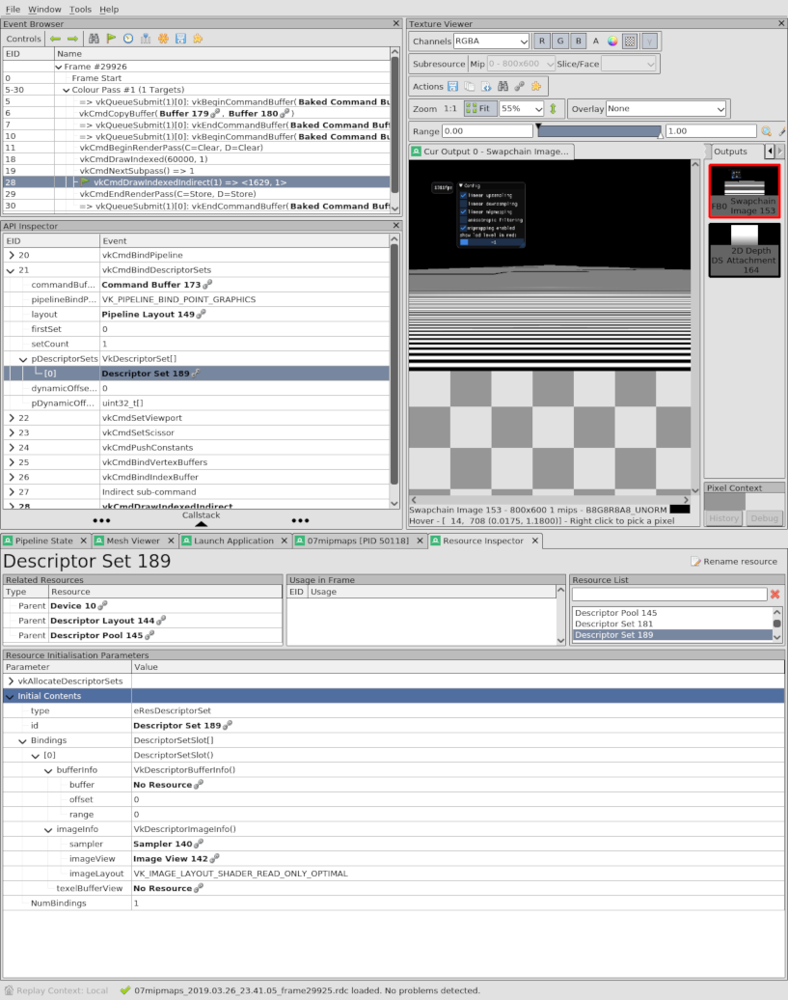

<table cellspacing="0" cellpadding="0"><tbody>
<tr valign="top"><td width="60%" colspan="2">

# Volcano Sample 7: Mip maps

This sample loads a texture using [skia](http://skia.org) and generates a
mip map from the source image.

</td></tr><tr valign="top"><td width="60%">

[View source code](./)

1. [Goals](#goals)
1. [Texture Sampler](#texture-sampler)
   1. [Quick Review of Descriptor Set, Descriptor Layout and Descriptor Binding](#quick-review-of-descriptor-set-descriptor-layout-and-descriptor-binding)
   1. [Multiple Descriptor Set Layouts](#multiple-descriptor-set-layouts)
   1. [Must use a whole different Sampler to enable mipmapping](#must-use-a-whole-different-sampler-to-enable-mipmapping)
1. [Generating a Mipmapped Image](#generating-a-mipmapped-image)
   1. [Loading It Into The Sampler](#loading-it-into-the-sampler)
   1. [Vulkan Spec](#vulkan-spec)
   1. [Other Tools](#other-tools)
1. [Texture Compression](#texture-compression)
   1. [Generating compressed textures](#generating-compressed-textures)
1. [External Libraries](#external-libraries)
   1. [Dear ImGui](#dear-imgui)
   1. [Subninja And Subgn](#subninja-and-subgn)
1. [The End](#the-end)

</td><td width="40%">


This sample is not automatically built.

Build it by typing:<br/>
`vendor/subgn/ninja -C out/Debug 07mipmaps`

Run it by typing:<br/>`out/Debug/07mipmaps`

Vulkan Validation layers are enabled by setting the `VK_INSTANCE_LAYERS`
environment variable.</td></tr>
</tbody></table>

## Goals

This sample covers the following topics:

1. Expand the fragment shader to read from a sampler and render a texture
1. Generate a mipmapped image from a PNG
1. What `memory::Stage` and `memory::Flight` classes do
1. Add a simple GUI to the app using
   [Dear ImGui](https://github.com/ocornut/imgui)

## Texture Sampler

[Sample 5](../05indexbuffer/README.md) introduced descriptor sets. This sample
creates a more complex descriptor set with two bindings:

1. [07mipmaps.vert](07mipmaps.vert) defines a uniform buffer at `binding = 0`
   which is pretty much the same as [Sample 5](../05indexbuffer/README.md), but
   the `descriptorSet->write()` code moved to UniformGlue.

1. [07mipmaps.frag](07mipmaps.frag) adds a sampler at `binding = 1`. It must
   have a Sampler object passed in a separate `descriptorSet->write()` call.

[Sample 5](../05indexbuffer/README.md) had a `ds->write()`, and this sample
uses [UniformGlue](../src/uniform_glue.cpp) to accomplish the same thing. The
`Buffer UniformGlue::uniform` is written to the descriptor set in
[uniform_glue.cpp](../src/uniform_glue.cpp):

```C++
int UniformGlue::buildFramebuf(size_t framebuf_i, size_t poolQindex) {
...
  std::shared_ptr<memory::DescriptorSet> ds =
      descriptorLibrary.makeSet(0, maxLayoutIndex);
  if (!ds) {
    logE("[%zu] descriptorLibrary.makeSet failed for uniform buffer\n",
         framebuf_i);
    return 1;
  }
  descriptorSet.push_back(ds);
  if (ds->write(uboBindingIndex, {&uniform.back()})) {
    logE("ds[%zu].write(uniform[%zu]) failed\n", framebuf_i, framebuf_i);
    return 1;
  }
```

The above code writes the ubo to `binding = 0`.

This code in [07mipmaps.cpp](07mipmaps.cpp) writes the sampler to
`binding = 1`:

```C++
int buildFramebuf(language::Framebuf& framebuf, size_t framebuf_i) {
  if (uglue.descriptorSet.at(framebuf_i)
          ->write(frag::bindingIndexOftexSampler(),
                  {mipEnable ? &sampleAndMip : &sampleNoMip})) {
    return 1;
  }
```

The functions
`bindingIndexOfUniformBuffer()` (which returns 0) and
`bindingIndexOftexSampler()` (which returns 1) are from shader reflection
so you can conveniently use the binding index that was set by the
shader:

```C++
layout(binding = 1) uniform sampler2D texSampler;
```

The fragment shader can then sample the texture with this GLSL code:
```C++
vec4 origColor = texture(texSampler, fragTexCoord);
```

### Quick Review of Descriptor Set, Descriptor Layout and Descriptor Binding

Though [Sample 5](../05indexbuffer/README.md) introduced all these concepts,
it is normal to have questions such as:

* What object types are accepted by which Descriptor Sets?

* When can the Binding Index be the same? When does it have to be set to a
  new value?

* When can the Layout Index be the same? When does it have to be different?

The short answer to all of the above questions is:
**your shaders define what their inputs are.**

That is why this sample feeds all the shaders into a `ShaderLibrary`
with `shaders.add()` first. Then, once the inputs and outputs have been
found using shader reflection, `shaders.finalizeDescriptorLibrary` can spit
out a `descriptorLibrary` with types, layouts, and binding indices.

### Multiple Descriptor Set Layouts

Since a shader can get its inputs across as many Descriptor Sets as you
care to use, why would the app ever want anything more complex than one
handle per Descriptor Set?

> Important Note: Vulkan Devices can allow as few as 4 simultaneous
> `maxBoundDescriptorSets`.
> [Many devices do have this tiny limit](http://vulkan.gpuinfo.org/listreports.php?limit=maxBoundDescriptorSets&value=4)
> but a single Descriptor Set can have lots of different things in it.
>
> In more concrete terms, each `layout(set = N)` can have many different
> bindings. There might be:
> ```
> layout(set = 42, binding = 0) uniform UniformBufferObject{}
> ```
> Along with:
> ```
> layout(set = 42, binding = 1) uniform sampler2D texSampler
> ```
> They both form just one **Descriptor Set 42**.

Now, back to the question. Why would an app ever want more than one Vulkan
handle per Descriptor Set?

The short answer is: it isn't too hard to pack everything into one
Descriptor Set.

Your app would normally have just one Descriptor Set Layout. You might
have one Descriptor Set for each framebuffer, but they all use that lonely
Descriptor Set Layout.

This leads to another interesting thought: would your app ever need more
than one Descriptor Set Layout?

Yes. Your app might need one Descriptor Set Layout for each set of shaders that
gets put together to form a RenderPass. But also consider that many shaders
can share a Descriptor Set Layout.

In this sample, the vertex + fragment shaders to render the GUI do not have
anything in common with the vertex + fragment shaders of the main app.

The `maxBoundDescriptorSets` limit is only for the resources bound during a
single subpass, so binding different resources to a different set of shaders
makes sense. Though if you can afford to use up more bindings, it may be faster
to bind everything at once and do it all as a single subpass.

In this sample, the shaders to render the GUI use layout 1. The main shaders use
layout 0. You won't find the main shaders' GLSL stating `layout 0` anywhere.
Nor do the GUI shaders state `layout 1`. Why?

(Answer: the layout numbering is dynamically chosen by the app as it chooses
what subpasses to put together into a RenderPass. Within a single subpass,
**all shaders must use the same Descriptor Set Layout.**)

Here is the RenderDoc capture for the main subpass. EID 13 is the
`vkCmdBindDescriptorSets` for layout 0 containing `ubo` and `texSampler`.


And here is the RenderDoc capture for the GUI subpass. EID 21 is the
`vkCmdBindDescriptorSets` for layout 1 containing `fontSampler`.



Can you locate their Descriptor Set Layout objects?

### Must use a whole different Sampler to enable mipmapping

Back in [Sample 6](../06threepipelines/README.md), each different subpass had
different pipeline state because Vulkan doesn't allow dynamic changes to
pipeline state (for most things).

A similar situation occurs for Samplers. Vulkan doesn't allow you to
dynamically turn mipmapping on or off. The mipmapping state must be set when
the Sampler is created. Each different Sampler can have a different
mipmapping state.

This sample demonstrates the use of two Samplers. One has mipmapping enabled.
The other has mipmapping disabled.

The `initTextureSampler()` function is used twice since most of the setup code
is the same between the two Samplers.

To switch which Sampler is used while running, the app must rebuild the command
buffers:

```C++
// if samplerNeedsRebuild is set to true, the command buffers are rebuilt
bool samplerNeedsRebuild = false;
{
  bool prev = magLinear;
  ImGui::Checkbox("linear upsampling", &magLinear);
  samplerNeedsRebuild |= prev != magLinear;
  prev = minLinear;
  ImGui::Checkbox("linear downsampling", &minLinear);
  samplerNeedsRebuild |= prev != minLinear;
  prev = mipLinear;
  ImGui::Checkbox("linear mipmapping", &mipLinear);
  samplerNeedsRebuild |= prev != mipLinear;
  prev = anisoEnable;
  ImGui::Checkbox("anisotropic filtering", &anisoEnable);
  samplerNeedsRebuild |= prev != anisoEnable;
  prev = mipEnable;
  int prevLod = debugOneLod;
  ImGui::Checkbox("mipmapping enabled", &mipEnable);
  ImGui::Text("show lod level in red:");
  ImGui::PushItemWidth(ImGui::GetWindowWidth());
  ImGui::SliderInt("", &debugOneLod, -1, sampleAndMip.info.maxLod - 1);
  ImGui::PopItemWidth();
  samplerNeedsRebuild |= prev != mipEnable;
  samplerNeedsRebuild |= prevLod != debugOneLod;
}
...
if (samplerNeedsRebuild) {
  setSamplerFlags(sampleAndMip);
  setSamplerFlags(sampleNoMip);
  if (cpool.deviceWaitIdle() || sampleAndMip.ctorErrorNoImageViewInit() ||
      sampleNoMip.ctorErrorNoImageViewInit() ||
      onResized(cpool.dev.swapChainInfo.imageExtent,
                memory::ASSUME_POOL_QINDEX)) {
    logE("sampleAndMip or onResized failed during sampler rebuild\n");
    return 1;
  }
}
```

## Generating a Mipmapped Image

The source image is [zebra01.png](zebra01.png), which contains black and white
rows. The black and white maximize the contrast between pixels. Try out the
app. Can you see what the different mipmapping parameters do?

A mipmap is an array of images. Each mip level is half the size of the previous
mip level. Mip level 0 is the original image. The highest mip level is an
1x1 image. Mipmapping is an optimization that lets the GPU choose just a few
pixels to read rathen than have to resize the entire mip level 0 just to
find a single sample.

That does not imply that, if you disable mipmapping, the GPU will actually
do all that work to resize the entire mip level 0 for each sample. If you
disable mipmapping, the GPU still only samples from a few texels. Since the
GPU can't sample from mip levels higher than 0, the texels it chooses to
sample from will not give enough information, and the rendered output looks
"jaggy."

In a similar way, changing the sampler from `VK_FILTER_LINEAR` to
`VK_FILTER_NEAREST` produces "jaggy" black or white pixels rather than
smoothly averaging black and white into a nice gray color.

This sample can be a fun way to "expose the cheating" the GPU does. With all the
options turned on, the rendered output smoothly becomes gray. With the options
turned off, "jaggy" pixels that are too black or too white appear.

In pseudocode, this is how a mipmap is made:

1. Save the input image as "LOD level 0" or "mip level 0". Set N = 0.
1. Scale the current mip level to half its size.
1. That becomes the next "LOD level N+1" or "mip level N+1". Set N = N + 1.
1. If the image dimensions are only 1x1 pixels, stop.
1. Otherwise, go back to step 2.

The code that does this is in [0701png2texture.cpp](0701png2texture.cpp).
The first function, `generateMipMap()`, calls `science::copyImageToMipmap()`.
Take a look at the
[source code](https://github.com/ndsol/volcano/blob/master/src/science/image.cpp):
It calls `blitImage()` to scale the image down, cutting the width and height in
half each time:

```C++
  e.width >>= 1;  // Progressively cut e in half.
  e.height >>= 1;
```

**NOTE:** When 0701png2texture is executed, it runs in the `out/Debug` dir. On
Windows, this means it logs any messages to
`VolcanoSamples\out\Debug\volcano.log` while 07mipmaps logs messages to
`VolcanoSamples\volcano.log`. 0701png2texture also writes a visualization of
the mip mapping to `VolcanoSamples/out/Debug/gen/07mipmaps/zebra01mips.png`,
showing the sequentially smaller images produced:


The actual texture is produced in
`VolcanoSamples/out/Debug/gen/07mipmaps/zebra01.ktx`

### Loading It Into The Sampler

The final step is to read `zebra01.ktx` into a `Sampler`. This is a very
useful code path, in `loadGLI()` and `constructSamplerGLI()`. Sample 7
calls into it from `initTextureSampler()`.

```C++
int initTextureSampler(science::Sampler& sampler, bool andMip) {
  std::string textureFound;
  gli::texture gli_mem;
  if (loadGLI("zebra01.ktx", textureFound, gli_mem)) {
    return 1;
  }
  if (gli_mem.empty()) {
    logE("gli::load(%s) failed\n", textureFound.c_str());
    return 1;
  }
  gli::texture2d tex(gli_mem);
  if (tex.empty()) {
    logE("gli::texture2d(%s) failed\n", textureFound.c_str());
    return 1;
  }
  sampler.info.maxLod = andMip ? tex.levels() : 1;
  return setSamplerFlags(sampler) ||
         constructSamplerGLI(sampler, uglue.stage, tex);
}
```

Please take a minute and look at the code in
[src/load_gli.cpp](../src/load_gli.cpp). It calls `gli::load()`, which may or
may not be familiar to you. The code also uses two classes:

1. `memory::Stage` (this is `UniformGlue::stage`)
1. `memory::Flight`

`memory::Stage` keeps a small number of staging buffers around, ready for your
app to use. You retrieve one by calling `memory::Stage::mmap()`. That returns
a `memory::Flight` for the in-flight copy operation. If the device has a
unified memory model and the CPU can directly write to GPU memory (such as with
Intel GPUs and Android devices) these classes automatically collapse the
operation into an optimal zero-copy direct write to GPU memory.

If `memory::Flight` seems familiar to you, it's used by the
`redraw()` function in Sample 6, this sample, the next one, etc. because it's
super convenient to have `UniformGlue` provide an in-flight staging buffer
to update the uniform buffer each frame.

### Vulkan Spec

You may be curious for more information about LOD levels, mip mapping or what
texels the GPU would use. The actual Vulkan spec is quite useful:

1. First read
   [Level-of-Detail Operation](https://www.khronos.org/registry/vulkan/specs/1.1-extensions/html/chap15.html#textures-level-of-detail-operation)
   to understand the lambda parameter. The lambda parameter selects which
   LOD levels (mip levels) to use. For example, lambda = 0 selects the original
   image.

1. Then
   [Image Sample Operations](https://www.khronos.org/registry/vulkan/specs/1.1-extensions/html/chap15.html#textures-sample-operations)
   explains nicely how a sampler operates including what texels are used.

### Other Tools

Here is a short list of useful tools for working with textures:

* [Blender and GIMP (Wikibook)](https://en.wikibooks.org/wiki/Blender_3D:_Noob_to_Pro)
* [AMD Compressonator](https://github.com/GPUOpen-Tools/Compressonator/wiki/Technical-Documentation)
* [NVidia BC/DXT/S3TC Texture Tools (Windows only)](https://developer.nvidia.com/gpu-accelerated-texture-compression)

## Texture Compression

Vulkan supports 3 major texture compression algorithms:

1. **Block Compression (BC)**

   This is also known as
   [DXT and S3TC](https://developer.nvidia.com/astc-texture-compression-for-game-assets#_Toc398571908).

   This compresses images by finding patterns in 4x4 blocks of texels.
   [Nathan Reed](http://www.reedbeta.com/blog/understanding-bcn-texture-compression-formats/#comparison-table)
   summarizes BC1 - BC7.

   Supported by the major Desktop GPUs. NVidia adds support for its Android
   devices (including Pixel C).

1. **Adaptable Scalable Texture Compression (ASTC)**

   [ASTC](https://developer.nvidia.com/astc-texture-compression-for-game-assets#_Toc398571908)
   was developed by Khronos while they developed OpenGL ES 3.0.

   Supported by Intel Desktop GPUs and several Android devices (Qualcomm
   Adreno, ARM Mali, NVidia).

1. **Ericsson Texture Compression 2 (ETC2)**

   [ETC2](https://en.wikipedia.org/wiki/Ericsson_Texture_Compression#ETC2_and_EAC)
   was developed in between BC/DXT/S3TC and ASTC.

Many good articles exist about how these work under the hood. But the problem
is Vulkan does not require texture compression for Vulkan certification.

1. BC/DXT/S3TC is not supported on mobile devices.
1. ASTC is only supported on mobile devices (including NVIDIA and Apple).
   Intel desktop GPUs support ASTC.
1. ETC2 performs only moderately well, has the widest support, but
   is not supported by NVidia desktop GPUs (probably due to a patent issue).
1. PVRTC is a proprietary format supported on Apple iOS devices.

An emerging open standard,
[Basis Universal](https://github.com/binomialLLC/basis_universal)
supports all of the above formats by supercompressing the texture.

1. Original Texture in a lossless format (.png)
1. Encode and Supercompress to .basis format - the reference image is 469kB
1. Load the .basis file into GPU RAM
1. Transcode to any of the above formats
   (PVRTC 2MB, ETC 2MB, ASTC not yet benchmarked, BC7 4MB)
1. The texture stays in the transcoded format in GPU RAM. It is never
   fully uncompressed, since the GPU hardware can do the final decompression.

Basis Universal has been adopted by Khronos Group for their
[glTF format](https://www.khronos.org/blog/google-and-binomial-contribute-basis-universal-texture-format-to-khronos-gltf-3d-transmission-open-standard)
but the details have yet to be published.

### Generating compressed textures

The
[Basis Universal Compression Tool](https://github.com/BinomialLLC/basis_universal/#command-line-compression-tool)
currently does not support GPU-accelerated compression.

[NVidia suggests](https://developer.nvidia.com/astc-texture-compression-for-game-assets#_Toc398571913),
"Do a high-quality compression of all assets overnight (or over days)."
Here NVidia isn't talking about Basis Universal, but highly compressed textures
have always required enormous amounts of CPU cycles. Typically it is
possible to generate a "quick" compressed texture during development, then
"bake" the final textures very late in the app's development.

<details>
<summary>
There are other texture compression libraries. [Click to expand]
</summary>

* [github.com/GPUOpen-Tools/Compressonator](https://github.com/GPUOpen-Tools/Compressonator) - AMD Compressonator has a Windows GUI and cross-platform
  CLI for generating ASTC, DXT and ETC textures.
* [github.com/castano/nvidia-texture-tools](https://github.com/castano/nvidia-texture-tools) - NVIDIA Texture Tools are a CLI encoder for DXT.
* [github.com/ARM-software/astc-encoder](https://github.com/ARM-software/astc-encoder) - ARM ASTC encoder is a reference CLI encoder for ASTC.

</details>

## External Libraries

<details>
<summary>
[Volcano](https://github.com/ndsol/volcano) has many useful libraries
built in. Your app can use them - they should just work. [Click to expand]
</summary>

* [VulkanMemoryAllocator](https://gpuopen-librariesandsdks.github.io/VulkanMemoryAllocator/html/)
  managers your app's use of memory.
  1. You can disable it by running `gn args` then specifying
     `use_vulkanmemoryallocator = false` (vendor/volcano/BUILD.gn will add
     `#define use_vulkanmemoryallocator = false` if you disable it.)
  1. It can dump your app's memory usage and even render it as a visualization.
  1. It can log a trace of all memory allocations - see
     `VmaAllocatorCreateInfo::pRecordSettings`.
  1. It can simulate a device with less Vulkan device memory (for compatibility
     testing) - see `VmaAllocatorCreateInfo::pHeapSizeLimit`.
  1. It automatically uses the following Vulkan extensions when they are
     available:
     * VK_KHR_get_memory_requirements2 and VK_KHR_dedicated_allocation (which
       have been incorporated into core Vulkan 1.1)
     * VK_AMD_memory_allocation_behavior
* [Ninja](https://ninja-build.org) is a fast build system.
* [GN](https://gn.googlesource.com/gn/) is the build system used by the
  Chrome browser.
* [Skia](https://skia.org) is the 2D graphics library used by the Chrome
  browser. chrome://gpu lists the Skia build version under
  "2D graphics backend."
* [GLFW](https://www.glfw.org) is a cross-platform windowing system.
  [Sample 4](../04android) documents GLFW's added Android support.
* [GLM](https://glm.g-truc.net/) is a widely used math library for 3D
  rendering.
* [GLI](https://gli.g-truc.net/) is a widely used image library for 3D
  rendering.
* [Dear Imgui](https://github.com/ocornut/imgui) is a widely used GUI for
  Vulkan and OpenGL apps.
* [glslang](https://github.com/KhronosGroup/glslang) is the reference compiler
  for GLSL and is automatically used.
* [SPIRV-cross](https://github.com/KhronosGroup/SPIRV-Cross) is a
  decompiler that does the opposite of glslang. It is automatically used to
  do shader reflection.
* [SPIRV-tools](https://github.com/KhronosGroup/SPIRV-Tools) is the official
  SPIR-V library, used by glslang and other libraries.
* [GoogleTest](https://android.googlesource.com/platform/external/googletest)
  is a unit test framework.
* [MoltenVK](https://github.com/KhronosGroup/MoltenVK) emulates Vulkan on
  Apple macOS and iOS devices and is automatically enabled for those platforms.
  * Type `export MVK_CONFIG_DISPLAY_WATERMARK=1` before executing an app to
    show the MoltenVK watermark.
* [JSONcpp](https://github.com/open-source-parsers/jsoncpp),
  [cereal](https://github.com/USCiLab/cereal),
  [expat](https://libexpat.github.io/)
* Image formats (everything a Chrome browser supports):
  [libpng](http://www.libpng.org/pub/png/libpng.html),
  [libjpeg-turbo](https://libjpeg-turbo.org/),
  [WebP](https://chromium.googlesource.com/webm/libwebp/+/refs/heads/master/README),
  [piex](https://github.com/google/piex)
* Font libraries: freetype, harfbuzz, sfntly
* [lua](https://github.com/lua/lua) scripting language
* [zlib](https://www.zlib.net)
* [GNU Libmicrohttpd](https://www.gnu.org/software/libmicrohttpd/)
* [Assimp](http://www.asimp.org) Open Asset Import Library
  (part of [VolcanoSamples](https://www.github.com/ndsol/VolcanoSamples), but
  not Volcano)

</details>

### Dear ImGui

This sample demonstrates using [Dear Imgui](https://github.com/ocornut/imgui).
Most of the code is in UniformGlue to create an additional subpass and write
the font texture sampler to the right descriptor set.

The sample shows how to call `uglue.imGuiInit()`, `ImGui::NewFrame()`, and
`ImGui::Begin("Title");`.

The rest is automatically handled by `uglue.buildPassAndTriggerResize()`,
`uglue.endRenderPass()` and `uglue.submitUniform()`. These functions are used
to simplify the code as [Sample 6](../06threepipelines/README.md)
demonstrates. All the hooks needed to provide Dear ImGui are implemented in
them as well.

If `uglue.imGuiInit()` is never called, the Dear ImGui code strives to not
allocate any resources or subpasses, that is, to occupy zero Vulkan overhead.

### Subninja And Subgn

This sample also demonstrates the use of subgn.

[Skia](https://github.com/ndsol/subskia) has its own *separate* set of ninja
files. [subgn](https://github.com/ndsol/subgn) integrates Skia by using a
forked version of gn called "subgn," with just that added feature of being able
to use nested ninja projects.

This allows any project to use skia. The files in
[volcano/src/gn/vendor/skia](https://github.com/ndsol/volcano/blob/master/src/gn/vendor/skia),
let these samples use skia, especially `BUILD.gn` and `skiaTarget.gni`.

To add skia to any BUILD.gn project, in short:

1. The repo must have a symlink pointing to the volcano git submodule
   under the `src` dir: `gn -> ../vendor/volcano/src/gn`.
1. Add an entry in the BUILD.gn file `deps`:
   "//src/gn/vendor/skia"
1. Use #include directives as necessary. For example,
   `#include "SkCodec.h"`, if your app uses the SkCodec class.
1. (Optional) Add "//src/gn/vendor/skia:skiaglue" if it is helpful.
   Then add `#include <src/gn/vendor/skia/skiaglue.h>` to the source code.

## The End

Hopefully at this point you understand Vulkan texture samplers.

1. What a mipmap is and why GPUs use them
1. How to make a mipmapped image
1. How to load a texture in a Vulkan app
1. How to bind a texture to a descriptor set
1. How to switch to a different Sampler to change its settings
1. How to enable Dear ImGui

### Homework

There are many advanced topics to study about Vulkan textures. At this point,
the recommended next step is to jump back into the "Learn OpenGL" tutorials
available online.

What? OpenGL? Yes, because it's still important to be good at translating the
concepts between OpenGL and Vulkan. It's not a problem if you know Vulkan better
than you know OpenGL.

Here are some advanced topics to study about OpenGL textures (and apply to
Vulkan):

1. [How a texture is sampled (basic concepts)](https://learnopengl.com/Getting-started/Textures)
  1. Texture coordinate space (U, V). Wrapping/clipping in (U, V) space.
  1. Mipmaps
1. [Normal mapping](https://learnopengl.com/Advanced-Lighting/Normal-Mapping)
  1. Why normals are stored in the model. If it were just the perpendicular to
     the triangle it could be computed in the vertex shader.
  1. Tangent and bitangent normals
1. Cube maps (covered more in [Sample 10](../10cubemap/README.md))
1. [Anti aliasing](https://learnopengl.com/Advanced-OpenGL/Anti-Aliasing)
  1. Multisampling
  1. Adaptive Super Sampling


### build-android.py from a Windows build host

Skia does not currently have a
[Windows Build setup to build for Android](https://chromium.googlesource.com/skia/+/chrome/m49/site/user/quick/android.md):

> Currently we only support building Skia for Android on a Linux or Mac host!
In addition, we only use the Mac build for local development. All shipping
variants are compiled on Linux for performance reasons.

This is tracked in
[Volcano Issue #5](https://github.com/ndsol/volcano/issues/5).


Copyright (c) 2017-2018 the Volcano Authors. All rights reserved.
