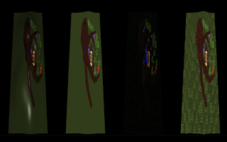

<table cellspacing="0" cellpadding="0"><tbody>
<tr valign="top"><td width="60%" colspan="2">

# Volcano Sample 8: Specialization Constants

This sample builds on the [previous](../06threepipelines/README.md)
[samples](../07mipmaps/README.md) and uses a single uber-shader instead of
3 separate shaders.

</td></tr><tr valign="top"><td width="60%">

[View source code](./)

1. [Goals](#goals)
1. [Reflection Recap: Namespaces](#reflection-recap-namespaces)
1. [Specialization](#specialization)
   1. [How to use one shader to do multiple things](#how-to-use-one-shader-to-do-multiple-things)
   1. [An Uber-Shader](#an-uber-shader)
   1. [When the optimization happens](#when-the-optimization-happens)
1. [The End](#the-end)

</td><td width="40%">



This sample is not automatically built.

Build it by typing: (all on one line)<br/>
`vendor/subgn/ninja -C out/Debug 08specialization`

Run it by typing:<br/>`out/Debug/08specialization`

Vulkan Validation layers are enabled by setting the `VK_INSTANCE_LAYERS`
environment variable.</td></tr>
</tbody></table>

## Goals

After studying this sample, hopefully you can:

1. Structure a GLSL program to benefit from specialization

## Reflection Recap: Namespaces

Remember that it is normal for GLSL shaders to redefine the same identifiers.
When you #include the identifiers into your app, you may need to place each
#include in a separate namespace. This is crucial when using specialization
constants because every shader will define `struct SpecializationConstants`.
Using a separate namespace for each #include prevents them from colliding:

```C++
#include "08specialization/struct_08specialization.vert.h"
namespace frag {
#include "08specialization/struct_08specialization.frag.h"
}
```

## Specialization

GLSL compilers such as `glslangValidator` do not support multiple source
files or #include directives. (NOTE: Google `shaderc` does.)

This results in a lot of duplicated code. In
[Sample 6](../06threepipelines/README.md), code is duplicated across
06phong.frag, 06toon.frag, and 06wireframe.frag. The duplicated code is:

```C++
#version 450
#extension GL_ARB_separate_shader_objects : enable

// Specify outputs. location = 0 references the index in
// VkSubpassDescription.pcolorAttachments[].
layout (location = 0) out vec4 outColor;

// Specify inputs.
layout (location = 0) in vec3 fragNormal;
layout (location = 1) in vec3 fragColor;
layout (location = 2) in vec3 fragViewVec;
layout (location = 3) in vec3 fragLightVec;
```

[Don't Repeat Yourself](https://en.wikipedia.org/wiki/Don%27t_repeat_yourself).
In this sample, there is only one fragment shader which specifies inputs and
outputs - just once.

### How to use one shader to do multiple things

You have several options for telling a shader what path to take:

1. A Vertex input can include another field just for control of the shader.
1. A Uniform Buffer can include a "flat int".
1. A Specialization Constant *recompiles the shader* with a value you provide
   while running your app. It is constant during the shader, but you can
   re-specialize the shader as often as you need.

To know which is the best approach for you, consider the tradeoffs:

A **Vertex input** takes up the most RAM of these options. Every vertex must
encode the extra field. This might be useful for activating physically-based
rendering modes, but is probably not a good choice for changing the
shading like what this sample does.

A **Uniform Buffer** takes up a descriptor set. It can be changed using a
`DescriptorSet::write()` call. This might be useful for passing in the
model, view and projection matrices, but is probably not a good choice for
this sample because the GLSL compiler will not know which shading mode will be
used. As a result, the texture used for "textured mode" must be valid even when
rendering in wireframe mode, which is wasteful.

Setting a **Specialization Constant** lets the GPU driver optimize away anything
that becomes impossible to reach because of the constant. In this shader,
only one branch of this switch will be kept around depending on `SHADING_MODE`:

```C++
switch (SHADING_MODE) {
case 0:
  outColor = phongShading();
  break;
case 1:
  outColor = toonShading();
  break;
case 2:
  outColor = wireFrameShading();
  break;
case 3:
  outColor = texturedShading();
  break;
default:
  // If SHADING_MODE is something unexpected, this will help with debugging.
  outColor = vec4(0.5,0.5,0.5,1);
  break;
}
```

The GPU driver may not know how to optimize the shader, but most will, so
using a specialization constant is a good way to have one shader do many
different things.

### An Uber-Shader

Using one shader to do many things reduces code duplication. Shader reflection
even brings the GLSL code into your C++ code.

Using one shader has more benefits as well. If you write "library" code
(such as math functions, data packing/unpacking or access functions, etc.)
you get to avoid copy/pasting it into several GLSL files.

In this sample, one shader runs several times with different `SHADING_MODE`
values. The C++ code in this sample to prepare the shader with its
different `SHADING_MODE` values is this:

```C++
  for (int i = 0; i < NUM_PIPELINES; i++) {
    // Create a PipeBuilder for this fragmentShader.
    pipes.emplace_back(pass);
    auto& thePipe = pipes.back();
    if (uglue.shaders.add(thePipe, vertexShader) ||
        uglue.shaders.add(thePipe, fragmentShader) ||
        uglue.initPipeBuilderFrom(thePipe, vertices)) {
      logE("pipe[%d] failed\n", i);
      return 1;
    }

    frag::SpecializationConstants spec;
    spec.SHADING_MODE = i;
    if (thePipe.info().specialize(spec)) {
      logE("specialize[%d] failed\n", i);
      return 1;
    }
  }
```

### When the optimization happens

The GLSL to SPIR-V compiler known as `glslangValidator` does not know the
final GPU that the shader will run on. SPIR-V is platform-independent
bytecode which your app then sends to the GPU driver.

Because the specialization constants aren't available to `glslangValidator`
it does not eliminate any code paths. Your app includes all the code from
the GLSL when your app boots up.

The optimization happens when your app loads the SPIR-V bytecode into
Vulkan. The GPU driver then re-compiles from SPIR-V into a GPU native binary.
When you set a specialization constant, the GPU can eliminate any code that
it knows will never execute.

## The End

Hopefully at this point you can explain:

* When the compiler can optimize away dead code paths in GLSL
* Different options for controlling the code path in the shader

Copyright (c) 2017-2018 the Volcano Authors. All rights reserved.

Hidden Treasure scene used in this example
[Copyright Laurynas Jurgila](http://www.blendswap.com/user/PigArt).
