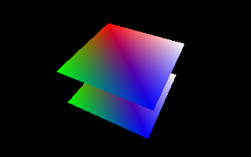

<table cellspacing="0" cellpadding="0"><tbody>
<tr valign="top"><td width="60%" colspan="2">

# Volcano Sample 9: Full Screen

This sample uses [Volcano](https://github.com/ndsol/volcano) to draw two
rotating squares on the screen. A series of GUI widgets allow you to
experiment with full screen modes.

</td></tr><tr valign="top"><td width="60%">

[View source code](./)

1. [Goals](#goals)
1. [Dynamic Full Screen](#dynamic-full-screen)
   1. [Android Full Screen](#android-full-screen)
   1. [Exclusive Full Screen](#exclusive-full-screen)
   1. [Non-Exclusive Full Screen](#non-exclusive-full-screen)
1. [VK_EXT_full_screen_exclusive](#vk_ext_full_screen_exclusive)
1. [Resources](#resources)
1. [The End](#the-end)

</td><td width="40%">



This sample is not automatically built.

Build it by typing:<br/>
`vendor/subgn/ninja -C out/Debug 09fullscreen`

Run it by typing:<br/>`out/Debug/09fullscreen`

Vulkan Validation layers are enabled by setting the `VK_INSTANCE_LAYERS`
environment variable.</td></tr>
</tbody></table>

## Goals

This sample is an updated form of [Sample 5](../05indexbuffer/README.md). It
adds:

1. Different types of full screen apps
1. Switching to full screen mode

## Dynamic Full Screen

"Full screen" can actually mean several different things. When your app wants to
fill the entire screen, here are some questions to think about:

* Do you only want to fill the entire screen?
* Do you allow other apps to display popup notifications?
* When the user switches apps, what does your app do?
* When the app runs on a dual-display system, what does your app do?

### Android Full Screen

Every Android app defaults to a full screen view. The OS controls this.
Android's
[multi-window support](https://developer.android.com/guide/topics/ui/multi-window)
does not keep updating the app after it loses the focus - you may want to at
least pause your render loop.

Android does allow your app to ask the OS to hide the softbuttons and top
menu.

### Exclusive Full Screen

Desktop OS's can give your app **exclusive** access to the screen.
The window compositor stops rendering other windows, leaving the GPU almost
entirely available for your use.

* Window decorations are hidden
* The window manager may turn off window composition.
* Popup notifications may cause the monitor to flicker annoyingly. The OS may
  offer a way to disable popup notifications.
* G-SYNC / FreeSync requires this (but they are not supported in this sample).
* Your app may decide to change the screen resolution. (This is not common
  anymore now with flat screen displays.)

### Non-Exclusive Full Screen

This is known as a "floating window" or "borderless floating window." Although
your app's window covers the entire screen, the entire desktop continues to
function behind your app:

* The window manager still composites your app with the rest of the desktop:
  
* Popup notifications are a thing, and may steal the focus from your app,
  which can annoy your users. However, the monitor will not flicker.

## VK_EXT_full_screen_exclusive

Not all OS's make Exclusive Full Screen easy to achieve. This prompted the
Khronos Group to add `VK_EXT_full_screen_exclusive` in the
[Vulkan 1.1.104 spec update](https://github.com/KhronosGroup/Vulkan-Docs/commit/476e3f422dc251065c535c1d8a5cfc58f1cff3c9)

With this extension, your application may:

* Leave things up to the OS implementation (this is what is shown in this
  sample)
* Or, explicitly disallow or allow "Exclusive full screen" using
  `VkSurfaceCapabilitiesFullScreenExclusiveEXT` to query support and
  `VkSurfaceFullScreenExclusiveInfoEXT` in the pNext chain of
  `vkCreateSwapchainKHR`.
* Or, directly request the mode of operation using
  `vkAcquireFullScreenExclusiveModeEXT` and
  `vkReleaseFullScreenExclusiveModeEXT`.

## Resources

The following list of resources may help you debug full screen
issues:

* https://github.com/GameTechDev/PresentMon

### Compositing / translucency / transparency

GLFW has a `GLFW_TRANSPARENT_FRAMEBUFFER` window hint for desktop windows.
This window hint must be set before creating the window (so, at startup).

Android doesn't work the same way, unfortunately. It uses
AndroidManifest.xml. (Be sure your Activity class does not extend
AppCompatActivity or ActionBarActivity, but just plain
`android.app.Activity`.) Then put this in AndroidManifest.xml:

```
<application
  android:theme="@android:style/Theme.Translucent.NoTitleBar">
```

The API to set this programmatically is an undocumented API. But here
is code that *might* work:

```
protected boolean useHiddenConvertToTranslucent() {
  // This adds windowIsTranslucent, even if the style was not
  // @android:style/Theme.Translucent.NoTitleBar
  try {
    java.lang.reflect.Method getActivityOptions =
      android.app.Activity.class.getDeclaredMethod("getActivityOptions");
    getActivityOptions.setAccessible(true);
    Object options = getActivityOptions.invoke(this);

    Class<?>[] classes = Activity.class.getDeclaredClasses();
    Class<?> translucentConversionListenerClazz = null;
    for (Class clazz : classes) {
      if (clazz.getSimpleName().contains("TranslucentConversionListener")) {
        translucentConversionListenerClazz = clazz;
      }
    }
    java.lang.reflect.Method convertToTranslucent =
        Activity.class.getDeclaredMethod("convertToTranslucent",
            translucentConversionListenerClazz,
            android.app.ActivityOptions.class);
    convertToTranslucent.setAccessible(true);
    convertToTranslucent.invoke(this, null, options);
    return true;
  } catch (Throwable t) {
    Log.w(TAG, "convertToTranslucent: " + t.getMessage(), t);
    return false;
  }
}
```

This sample uses the android:theme variable in AndroidManifest.xml.

Android has another option which *looks* transparent, but always shows
the desktop background (no icons or widgets). This will not have any
effect if the theme includes "windowIsTranslucent", but will not hurt.

```
// In onCreate():
android.view.Window win = getWindow();
win.setFlags(FLAG_SHOW_WALLPAPER, FLAG_SHOW_WALLPAPER);
win.setBackgroundDrawable(new ColorDrawable(Color.TRANSPARENT));
```

## The End

Hopefully at this point you have a better roadmap for how to:

* Enable full screen in your app
* Identify what type of full screen support the OS is using
* Request different full screen modes
