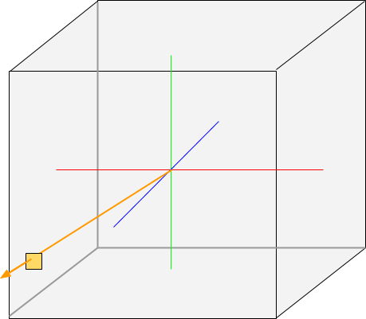
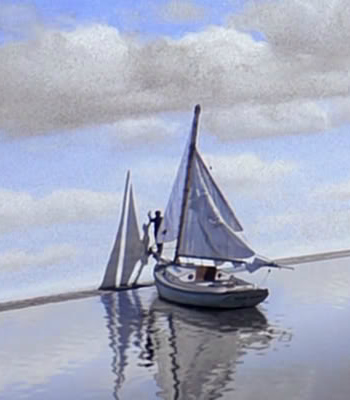

<table cellspacing="0" cellpadding="0"><tbody>
<tr valign="top"><td width="60%" colspan="2">

# Volcano Sample 10: Cube Maps and Image Arrays

This sample renders a cube map and an image array.

</td></tr><tr valign="top"><td width="60%">

[View source code](./)

1. [Goals](#goals)
1. [Where to Get a Cubemap on the Internet](#where-to-get-a-cubemap-on-the-internet)
   1. [HDR Tone Mapping](#hdr-tone-mapping)
   1. [Definition of Cube Map](#definition-of-cube-map)
   1. [What the Vertex Shader Does](#what-the-vertex-shader-does)
   1. [Spherical Panorama to Skybox](#spherical-panorama-to-skybox)
      1. [Definition of Skybox](#definition-of-skybox)
   1. [Implementing a Skybox](#implementing-a-skybox)
   1. [Making the Skybox a Big Skybox](#making-the-skybox-a-big-skybox)
   1. [Seamless Cubemaps](#seamless-cubemaps)
1. [Image Array](#image-array)
1. [The End](#the-end)

</td><td width="40%">


This sample is not automatically built.

Build it by typing:<br/>
`vendor/subgn/ninja -C out/Debug 10cubemap`

Run it by typing:<br/>`out/Debug/10cubemap`

Vulkan Validation layers are enabled by setting the `VK_INSTANCE_LAYERS`
environment variable.</td></tr>
</tbody></table>

## Goals

By the end of this sample, hopefully you feel like you know how to:

1. Pick a photo from the internet to use
1. Tell the difference between a spherical panorama, cubemap and skybox
1. Convert between them
1. Tell the difference between a cubemap and an image array

## Where to Get a Cubemap on the Internet

A cube map is a panoramic photo that has been exported as the six faces of a
cube. The cube map in this sample is a CC0 image from
[hdrihaven.com](https://hdrihaven.com). Consider donating to
[hdrihaven.com](https://hdrihaven.com) if you like this sample.

### HDR Tone Mapping

Files from that site are .hdr files (RGBE format). To convert it to a .jpg,
try
[LuminanceHDR](https://sourceforge.net/projects/qtpfsgui/).

Converting from .hdr to a screen-viewable format is known as
["tone mapping."](https://learnopengl.com/Advanced-Lighting/HDR)
Take some time to play around with a panorama in
[LuminanceHDR](https://www.flathub.org/apps/details/net.sourceforge.qtpfsgui.LuminanceHDR).
How do the different parameters change the rendered image?
([GIMP](https://www.gimp.org) can also
[work with](http://cgicoffee.com/blog/2016/07/hdr-image-manipulation-for-free-with-gimp-29)
HDR files.)

Look for:

* [Clipping](http://blog.hdrihaven.com/how-to-shoot-the-sun/). Your display
  probably doesn't produce light as strong as direct sunlight. A good
  tool will do tone mapping without clipping.
* [Banding](). Converting .hdr to the sRGB color space reduces the amount of
  information in each pixel of the image. Dark regions in the image may show it
  most visibly, especially if a smooth gradient becomes "striped."
* [Dithering](). One way to prevent banding is to artificially add a little 
  noise to the image.

This sample renders a .jpg to a cube map. You can export an SDR image from
within LuminanceHDR as a .jpg or use umhlanga-1k.jpg included with the
sample. It's just exported from one of the hdrihaven.com images.

*There is another sample image included, can you figure out how to get the*
*sample to use it?*

### Definition of Cube Map

A cube map is 6 textures in a convenient format for GPUs. The result of tone
mapping is still a *spherical* panorama, not a cube map. A spherical panorama
is a sphere of texels where the viewer is placed at the center. Since the GPU
doesn't handle spheres natively, your app can either:

1. Generate enough polygons to make an approximate sphere.
1. Convert the spherical panorama into something else.

It turns out you can get "enough polygons" by just drawing the 6 faces of a
cube:



The GPU will accept a single vector (the orange arrow above) and pick from 6
different textures automatically, as if they were in a cube shape. The sample
app still has to supply the cube to be drawn:

```C++
int addSkyboxToVertexIndex() {
  // Tell vertex shader it is the skybox by setting normal to (0, 0, 0).
  auto zero = glm::vec3(0, 0, 0);

  // sv array contains the vertices for the skybox:
  st_10cubemap_vert sv[] = {
      glm::vec3(-1., -1., -1.), zero, zero, glm::vec2(0, 0),  // UV does not
      glm::vec3(1., -1., -1.),  zero, zero, glm::vec2(0, 0),  // get used
      glm::vec3(-1., 1., -1.),  zero, zero, glm::vec2(0, 0),  // by skybox
      glm::vec3(1., 1., -1.),   zero, zero, glm::vec2(0, 0),  // texture()
      glm::vec3(-1., -1., 1.),  zero, zero, glm::vec2(0, 0),  // call.
      glm::vec3(1., -1., 1.),   zero, zero, glm::vec2(0, 0),
      glm::vec3(-1., 1., 1.),   zero, zero, glm::vec2(0, 0),
      glm::vec3(1., 1., 1.),    zero, zero, glm::vec2(0, 0),
  };
  ...
```

The GPU does its part by locating a sample (a single texel of color) at the
location corresponding to the point where the orrange arrow hits a unit cube,
represented in the image above by the orange square. Call `texture()`
to access your cube map. This is the code in [10cubemap.frag](10cubemap.frag):

```C++
#version 450
#extension GL_ARB_separate_shader_objects : enable

// Specify outputs. location = 0 references the index in
// VkSubpassDescription.pcolorAttachments[].
layout(location = 0) out vec4 outColor;

// Specify inputs that are constant ("uniform") for all vertices.
// The uniform buffer is updated by the app once per frame.
layout(binding = 0) uniform UniformBufferObject { ... } ubo;

// A samplerCube is declared "uniform" because the entire texture is accessible
// (read-only) in each invocation of the fragment shader.
layout(binding = 1) uniform samplerCube cubemap;

// Specify inputs.
layout(location = 0) in vec3 fragNormal;
layout(location = 1) in vec3 fragColor;
layout(location = 2) in vec3 fragViewVec;

void main() {
  if (fragNormal.x == 0 && fragNormal.y == 0 && fragNormal.z == 0) {
    outColor = texture(cubemap, fragViewVec);
  } else {
    ... fragment shader code for something else ...
  }
}
```

Compare a cube map to the `sampler2D` in
[Sample 8](../08specialization/README.md):

1. To use a `sampler2D`, your app must bind a 2D image to the `sampler2D`.
   Sample it in your fragment shader by providing a `vec2 uv`:

   `outColor = texture(theSampler2D, uv)`

1. To use a `samplerCube`, your app must bind six 2D images to the
   `samplerCube`. Sample it in your fragment shader by providing a
   `vec3 cameraDirection`:

   `outColor = texture(theSamplerCube, cameraDirection);`

### What the Vertex Shader Does

The vertex shader calculates the `vec3 cameraDirection` (orange arrow above).
The fixed function pipeline then forwards `cameraDirection` to the fragment
shader. But remember, the vertex shader output is interpolated, so each
fragment shader invocation will get a value somewhere in between the values
computed at each vertex.

In this sample, the [vertex shader](10cubemap.vert) writes to `fragViewVec`
instead of a variable named `cameraDirection`:

```C++
#version 450
#extension GL_ARB_separate_shader_objects : enable

// Specify outputs.
out gl_PerVertex {
  vec4 gl_Position;
};
layout(location = 0) out vec3 fragNormal;
layout(location = 1) out vec3 fragColor;
layout(location = 2) out vec3 fragViewVec;
layout(location = 3) out vec3 fragLightVec;
layout(location = 4) out vec2 fragTexCoord;

// Specify inputs that are constant ("uniform") for all vertices.
// The uniform buffer is updated by the app once per frame.
layout(binding = 0) uniform UniformBufferObject {
  mat4 modelview;
  mat4 invModelView;
  mat4 proj;
  vec4 lightPos;
  ...
} ubo;

// Specify inputs that vary per vertex (read from the vertex buffer).
// gl_VertexIndex is still defined as the vertex index (0 .. N).
layout(location = 0) in vec3 inPosition;
layout(location = 1) in vec3 inNormal;
layout(location = 2) in vec3 inColor;
layout(location = 3) in vec2 inTexCoord;

void main() {
  mat3 rot = mat3(ubo.modelview);
  vec4 modelPos = ubo.modelview * vec4(inPosition, 1.0);
  if (inNormal.x == 0 && inNormal.y == 0 && inNormal.z == 0) {
    // Use this vertex to draw the skybox. Ignore ubo.proj.
    fragNormal = inNormal;
    vec3 pos = inPosition;
    fragViewVec = pos;
    pos = rot * pos;
    pos.x = -pos.x;
    gl_Position = pos.xyzz;  // Force w == z, "move this fragment to back"
  } else {
    // This is a normal vertex. Use ubo.proj.
    fragNormal = normalize(rot * inNormal);
    fragViewVec = -modelPos.xyz;
    gl_Position = ubo.proj * modelPos;
  }
  fragColor = inColor;
  fragLightVec = rot * ubo.lightPos.xyz - modelPos.xyz;
  fragTexCoord = inTexCoord;
}
```

`fragViewVec.xyz` should be in the range (0, 1). The GPU normalizes it to be
of length == 1 when sampling from the cubemap. The vertex shader doesn't need
to, but should be careful not to output a vector with a very small length.

An early naive solution to drawing the cubemap at the maximum depth of 1
just set `gl_FragDepth = 1.0` in the fragment shader.
**Don't do this.** It is terribly slow on mobile devices. Set the depth in
the vertex shader. That's what the vertex shader is designed to do: compute
the x, y, and depth value for each vertex. Don't do that in a fragment shader.

### Spherical Panorama to Skybox

Converting a spherical panorama to a cube map
[involves some math](https://stackoverflow.com/questions/29678510/convert-21-equirectangular-panorama-to-cube-map)
but sooner or later in 3D programming, this kind of math comes along:

```C++
const float invPi = 1./3.141592653589;
const float sides = 4.;

// toElAzi converts eye to spherical coordinates.
vec2 toElAzi(vec3 eye) {
  return vec2(atan(-eye.z, eye.x) / 2, acos(eye.y / length(eye))) * invPi;
}

vec4 renderSides(vec4 eye) {
  vec2 p0 = toElAzi(eye.xyz);
  // Re-insert eye.w, i.e. assumed eye was side[1] before, now re-add 90 deg
  // for each side beyond side[1].
  return texture(texSampler, vec2(p0.x + eye.w / (sides * 2), p0.y));
}

void main() {
  // fragTexCoord: x in (-1, 1). y in (-1, 1) for one of the 4 sides of a cube.
  // side[0] is -X face. side[1] is +Z. side[2] is +X. side[3] is -Z.
  float x = (fragTexCoord.x + 1) * sides;
  float m = mod(x, 2) - 1;
  vec4 eye = vec4(m, fragTexCoord.y, 1, x - m - 3);
  outColor = renderSides(eye);
}
```

The actual [1001sphere2cube.frag](1001sphere2cube.frag) also renders the
top and bottom faces. This shortened form shows how the spherical coordinate
system is used to choose which texels from the equirectangular projection get
mapped to each face of the cubemap.

Since this sample is meant to handle 4K or larger images, it uses
[ScanlineDecoder](../src/scanlinedecoder.h) to decode a fixed amount of data
from the image, then upload it to the GPU. That means the memory usage is not
twice the size of the fully decoded, uncompressed image (decoding the entire
image on the CPU, then copying it all at once to the GPU requires two
full-sized buffers). [ScanlineDecoder](../src/scanlinedecoder.h) decodes
only a few rows from the image at a time.

#### Definition of Skybox

**(Mild spoiler alert)** What's the difference between a cube map and a skybox?

--------

> A **cube map** is just 6 textures provided to the renderer for any operation
> that maps a `vec3` to a texel.
>
> A **skybox** takes a cube map and renders a giant box around everything on
> the screen. Every skybox uses a cube map but a cube map can be used for more
> than just a skybox. For example, [10cubemap.frag](10cubemap.frag) uses the
> cube map to render a "shiny metal" effect. It also draws a skybox with the
> cube map.

--------

<table cellspacing="0" cellpadding="0"><tbody>
<tr valign="top"><td width="40%">



</td><td width="60%">

A skybox is a large cube drawn around everything else you see. In the
movie "The Truman Show," the main character
[crashes into the skybox with a boat.](https://reddit.com/r/movies/comments/2sff5q)

Everything you see is the "scene" to a 3D renderer. The skybox must be rendered
"bigger than everything else" or something will crash into it and your app will
look like The Truman Show.

In [BUILD.gn](BUILD.gn) the equirectangular projection `umhlanga-1k.jpg` is
converted into a cube map. The ":cubemap0.ktx" target calls sphere2cube.py
to run the code in
[1001sphere2cube.cpp](1001sphere2cube.cpp).</td></tr></table>

### Implementing a Skybox

[BUILD.gn](BUILD.gn) writes the files `out/Debug/gen/10cubemap/cubemap0.jpg`
through `out/Debug/gen/10cubemap/cubemap5.jpg`:

```
action("cubemap0.jpg") {
  deps = [ ":1001sphere2cube" ]
  script = "sphere2cube.py"
  args = [
    rebase_path("umhlanga-1k.jpg", root_build_dir),
    rebase_path("$target_gen_dir/$target_name", root_build_dir),
  ]
  outputs = [
    "$target_gen_dir/cubemap0.jpg",  # Left face
    "$target_gen_dir/cubemap1.jpg",  # Front face
    "$target_gen_dir/cubemap2.jpg",  # Right face
    "$target_gen_dir/cubemap3.jpg",  # Back face
    "$target_gen_dir/cubemap4.jpg",  # Top face
    "$target_gen_dir/cubemap5.jpg",  # Bottom face
  ]
}
```

Then this sample loads the textures and renders them as a skybox.

### Making the Skybox a Big Skybox

The skybox is scaled to the maximum possible Z-value by swizzling Z into the
W value in [10cubemap.vert](10cubemap.vert):

```
gl_Position = pos.xyzz;  // Force w == z, "move this fragment to back"
```

Anything drawn beyond that value would be clipped by the
`VkViewport::maxDepth` value anyway, so that is where the skybox is drawn.

Depth testing is also altered slightly. The depth comparison is less efficient
using VK_COMPARE_OP_LESS_OR_EQUAL, but that lets the sample render the skybox
*after* all other geometry.

Drawing the skybox *before* all other geometry would guarantee that any
fragments drawn by other geometry will draw over skybox fragments. This is
called "double fill rate." It requires the fragment shader to run twice for
that fragment.

Drawing the skybox *after* all other geometry lets the fragment shader only
run once for the fragment. It only draws the skybox on fragments that have
not been filled by other things:

```C++
  // Change from VK_COMPARE_OP_LESS to LESS_OR_EQUAL because the skybox is
  // drawn at Z = 1.0, the same as the empty (cleared) depth buffer.
  pipe0.info().depthsci.depthCompareOp = VK_COMPARE_OP_LESS_OR_EQUAL;
```

### Seamless Cubemaps

OpenGLs `ARB_seamless_cube_map` and `GL_TEXTURE_CUBE_MAP_SEAMLESS` flag are
incorporated into the Vulkan spec under the "cube map edge handling" section.

In other words, all Vulkan apps automatically use seamless cubemaps.

## Image Array

## The End

Hopefully at this point you feel comfortable with cube maps and image arrays.

1. 

### Homework


Copyright (c) 2017-2018 the Volcano Authors. All rights reserved.

Hidden Treasure scene used in this example
[Copyright Laurynas Jurgila](http://www.blendswap.com/user/PigArt).
