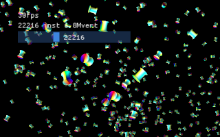
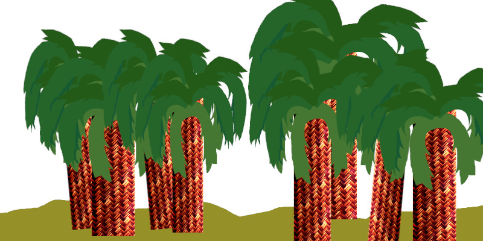

<table cellspacing="0" cellpadding="0"><tbody>
<tr valign="top"><td width="60%" colspan="2">

# Volcano Sample 13: Instancing

This sample uses [Volcano](https://github.com/ndsol/volcano) to draw
thousands of copies of the same mesh.

</td></tr><tr valign="top"><td width="60%">

[View source code](./)

1. [Goals](#goals)
1. [The Input Assembly Stage](#the-input-assembly-stage)
   1. [Instancing](#instancing)
1. [Per-instance data](#per-instance-data)
   1. [Uniform Buffer](#uniform-buffer)
   1. [Is a uniform buffer faster than VK_VERTEX_INPUT_RATE_INSTANCE?](#is-a-uniform-buffer-faster-than-vk_vertex_input_rate_instance)
1. [GLSL Quaternion Implementation](#glsl-quaternion-implementation)
1. [The End](#the-end)

</td><td width="40%">



This sample is not automatically built.

Build it by typing:<br/>
`vendor/subgn/ninja -C out/Debug 13instancing`

Run it by typing:<br/>`out/Debug/13instancing`

Vulkan Validation layers are enabled by setting the `VK_INSTANCE_LAYERS`
environment variable.</td></tr>
</tbody></table>

## Goals

This sample builds on [Sample 11](../11hdr/README.md). This focuses on the
**input assembly** stage of the GPU pipeline. This sample covers:

1. How the input assembler works
1. Two choices for the buffer that holds per-instance data

## The Input Assembly Stage

Way back in [Sample 5](../05indexbuffer) the
[pipeline stages](https://fgiesen.wordpress.com/2011/07/09/a-trip-through-the-graphics-pipeline-2011-index/)
of a Vulkan GPU
[were introduced](https://vulkan-tutorial.com/Drawing_a_triangle/Graphics_pipeline_basics).

Since the fully programmable stages are the ones that immediately demand
attention, the **Input Assembly Stage** didn't get much attention until now.

The input assembler is a "fixed function" pipeline stage. It looks up the index
buffer and converts indices into the actual vertex data for the vertex shader.
But it also can do another function:

### Instancing

Instancing repeats the same index buffer again. Like this:

```
function drawInstanced(indexBuffer, indexCount, instanceCount,
                       firstIndex, vertexOffset):
  for i = 0; i < instanceCount; i++ {
    for j = firstIndex; j < indexCount; j++ {
      index = indexBuffer[j]
      vertexData = getVertexData(vertexOffset + index)
      send vertexData to vertex shader
    }
  }
```

In the vertex shader, you get a new predefined variable: `gl_InstanceIndex`.

Why would anyone do this? The indexBuffer is used the same for each instance,
so this isn't a sneaky way to get bigger index buffers. Executing this draw
call with different vertexOffset values could be used for a bigger vertex
buffer, I guess, but there's still the question, why set instanceCount to
some big number?

## Per-instance data

Imagine you want to draw a desert oasis. You start with a nice model of
a palm tree:


By using per-instance data, you can stretch, flip, or rotate the model until
you have created your oasis:



The GPU can render this faster because it can keep the vertex and index
buffers in its cache. It swaps out the per-instance data, for example:

* Rotation and translation
* Scaling or flipped
* Different color
* Different texture (but compare a push constant and benchmark)
* Different material parameters for the fragment shader

This is useful **if the same model is reused a bunch of times** in the
render.

### Uniform buffer

All the vertex and fragment shaders can also read the uniform buffer.
A common pattern is to divide the data like this in the vertex shader:

**In the Uniform Buffer:**

1. Projection matrix (field of view, clip planes)
1. View matrix (camera position)
1. Global lights

**In the Per-Instance Data:**

1. Model matrix (pose of this palm tree or whatever)
1. Other per-instance data like material parameters

This leads to the first way of storing per-instance data: in the
uniform buffer! Pros and cons of using the uniform buffer:

1. Pro: Your app only updates one buffer per frame, the uniform buffer. Works
   well if the number of instances is a few hundred.
1. Pro: Your code is simpler.
1. Con: Because the uniform buffer is stored in a special cache, it cannot
   exceed 65536 bytes in size for a single shader invocation.<sup>1</sup> The
   way this sample gets around that is to introduce dynamic uniform buffers.
   This makes your app more complicated.
1. Con: Dynamic uniform buffers have a performance penalty on NVidia hardware.
1. Con: Because the uniform buffer is typically "triple buffered" to match the
   command buffer and frame buffer, your app **has to** update the whole
   uniform buffer each frame, or use a triple-buffer tracker to know if there
   can be any optimizations. (Which, not surprising, is complicated!)

<sup>1</sup> There are ARM Mali devices in 2020 that only support 16384 byte
uniform buffers!

On the other hand, perhaps your app doesn't *want* to update 100% of the
per-instance data for every frame. There is another way:
set `PipeBuilder::vertexInputs[N].inputRate = VK_VERTEX_INPUT_RATE_INSTANCE`

It tells Vulkan that the input laid out at `(binding = N)` is not in the
vertex buffer, with different values for all the vertices, but is read
from a separate buffer just once per instance. Call this new buffer the
instance buffer, even though Vulkan treats it just like a vertex buffer.

This has pros and cons of its own:

1. Pro: Effectively no limit on how many instances it can hold.
1. Pro: Your vertex shader is simpler. (You may not need to explicitly use
   `gl_InstanceIndex` at all.)
1. Pro: Less pressure on devices with 16384 byte uniform buffers.
1. Pro: Less ongoing maintenance if your uniform buffer format changes.
1. Con: When you want to update the instance buffer, such as when an object in
   the world moves, you get to "triple buffer" it (and now you are either doing
   full updates, or writing a complex triple-buffer tracker, or worse).

Your app could also mix and match both styles in different subpasses.

### Dynamic Uniform Buffers

This sample uses dynamic uniform buffers. The single large buffer created
in the UniformGlue constructor is split into an array of smaller
uniform buffers, and the command buffer includes commands to change the
one used for each draw call.

```C++
  uglue{*this, window, 0 /*maxLayoutIndex*/,
        vert_ubo::bindingIndexOfUniformBufferObject(),
        // Create a single large uniform buffer
        mmapMaxLimit /*uboSize*/},
```

Because dynamic uniform buffers use a different descriptor set type, make
sure to enable them with this code:

```C++
  if (uglue.setDynamicUniformBuffer(sizeUBO) ||
      uglue.buildPassAndTriggerResize()) {
    ... handle error ...
  }
```

This small function records a new uniform buffer offset into the
command buffer by binding the descriptor that holds the uniform buffer:

```C++
  int bindUBOandDS(size_t uboOffset, size_t framebuf_i) {
    std::vector<uint32_t> dynamicUBO;
    dynamicUBO.emplace_back(uboOffset);
    if (uglue.cmdBuffers.at(framebuf_i).bindDescriptorSets(
        VK_PIPELINE_BIND_POINT_GRAPHICS,
        pass.pipelines.at(0)->pipelineLayout,
        0 /*firstSet*/, 1 /*descriptorSetCount*/,
        &uglue.descriptorSet.at(framebuf_i)->vk,
        // Update dynamic UBO with the location of the current UBO
        dynamicUBO.size(), dynamicUBO.data())) {
      logE("bindUBOandDS(%zu): bindDescriptorSets failed\n", uboOffset);
      return 1;
    }
    return 0;
  }
```

### Is a uniform buffer faster than VK_VERTEX_INPUT_RATE_INSTANCE?

It appears this does not limit performance, at least not often, either way you
decide to go. No broad set of benchmarks has been done, but instance data is
rarely large enough to impact performance, even if you end up overwriting it
each frame.

NVidia GPUs may see performance degrade if you are changing the uniform buffer
offset often enough. They have dedicated uniform buffer hardware with a limit
of 65536 bytes. (Consult vulkan.gpuinfo.org for more information.)

*This is what the common saying means, when you hear*
*"avoid rebinding shader uniforms"!*

Benchmark it if it matters to you.

## GLSL Quaternion Implementation

This sample also demonstrates passing a quaternion (4 floats) plus a vector
(4 floats) to describe a rotation and a translation. While this prevents you from
the scaling shown in the oasis example above, it cuts the size of your instance
data in half, compared to a 4x4 matrix (16 floats).

The following GLSL code expands the quaternion back into a 3x3 matrix:

```
vec3 qrotate(vec4 rot, vec3 v){
  return v + 2.0 * cross(cross(v, rot.xyz) + rot.w * v, rot.xyz);
}

mat3 q_to_mat3(vec4 rot) {
  vec3 identity = vec3(1.0, 0.0, 0.0);
  return mat3(qrotate(rot, identity),
              qrotate(rot, identity.zxy),
              qrotate(rot, identity.yzx));
}
```

## The End

Hopefully at this point the Input Assembly Stage fits into the bigger GPU
pipeline:

* Instancing: like a giant copy machine for an entire 3D model
* The vertex shader: getting a little bit more complicated now
* Dynamic uniform buffers
