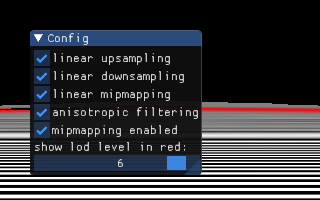
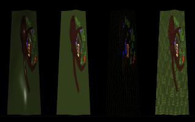
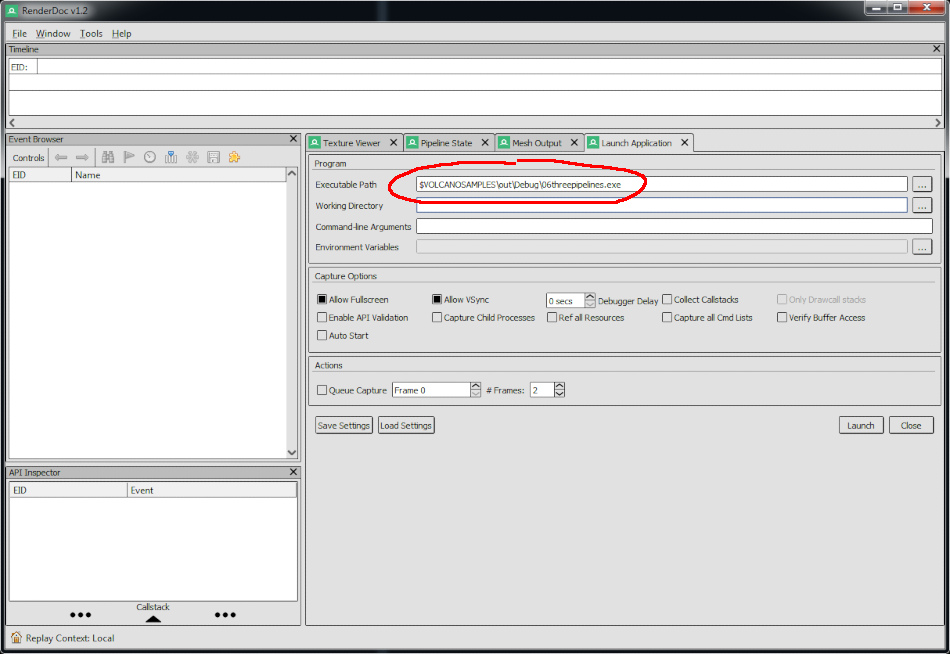

# [Volcano](https://github.com/ndsol/volcano) Samples

Volcano Samples are an intermediate Vulkan tutorial. Click on Sample 1 for
an introduction.

1. [ GLFW Vulkan application](01glfw/README.md)
1. ~~SDL Vulkan application~~ (Work in Progress)
1. [ Render To Disk](03rendertodisk/README.md)
1. [ Android Vulkan application](04android/README.md)
1. [ The Index Buffer](05indexbuffer/README.md)
1. [ Pipelines](06threepipelines/README.md)
1. [ Mipmaps](07mipmaps/README.md)
1. [ Specialization Constants](08specialization/README.md)
1. [ Full Screen](09fullscreen/README.md)
1. [ Cube Map](10cubemap/README.md)
1. [ Instancing](13instancing/README.md)

# Build Instructions

**VolcanoSamples pulls in [Volcano](https://github.com/ndsol/volcano)**
**for you.**

To build samples 1-5, type:
```
git clone https://github.com/ndsol/VolcanoSamples
VolcanoSamples/build.cmd
```
> On Windows, first install [git](https://git-scm.org), python 3 and
> [Visual C++](01glfw/visual-studio-cli.png). then type:
> `VolcanoSamples\build.cmd`

*Note: samples 6+ are built on demand. Each sample's README.md has instructions.*

### Toolkit

Lots of great tools offer an alternative view into how your app performs.
If you know of another great tool, please suggest it.

* **Vulkan Validation layers:** generally you want the validation layers
  enabled all the time. To set the environment variables, be sure to launch the
  app from the same command prompt as the `set` or `export` that enabled
  validation:

  Windows log is in volcano.log or Visual Studio's debug output:

  ```
  set VK_LAYER_PATH=%~dp0\out\Debug\vulkan\explicit_layer.d
  set VK_INSTANCE_LAYERS=VK_LAYER_LUNARG_standard_validation
  out/Debug/01glfw
  ```

  Mac and Linux log to the console:

  ```
  export VK_INSTANCE_LAYERS=VK_LAYER_LUNARG_standard_validation
  out/Debug/01glfw
  ```

* 
  <a href="https://renderdoc.org/"><b>RenderDoc</b></a>

  On linux, be sure to set LD_LIBRARY_PATH first:
  ```
  ./build.cmd && export LD_LIBRARY_PATH=$PWD/out/Debug
  ```

* [**AMD Radeon GPU Profiler**](https://gpuopen.com/rgp/)

  If you have an AMD GPU, inspect each part of the GPU's operations.

  

* [**NVIDIA Nsight Graphics**](https://developer.nvidia.com/nsight-graphics)

  If you have an NVIDIA GPU, you may be able to inspect each part of the GPU's
  operations.

  On linux, a C++ frame capture may fail to build with this error:
  `xcb/xcb_icccm.h: no such file or directory`.
  **Resolution:** you need to "apt install libxcb-icccm4-dev".

Copyright (c) 2017-2018 the Volcano Authors. All rights reserved.
